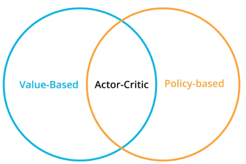

# Actor Critic Methods

使用value-based方法作为baseline,用来减少policy-based方法的variance
#### 估计Expected Return的方法
* Monte-Carlo estimate
  完成episode之后，计算discounted reward
  $$R_t=\sum_{k=0}^{\infin} \gamma R_{t+k+1}$$

  由于每个episode的结果不一样，对于同一个state，估计值有极大的**variant**，但是unbiased
* TD estimate
   $$v_\pi (s) = E_\pi[R_{t+1} + \gamma v_\pi(S_{t+1})|S_t=s]$$

   根据下个state的估计值来计算value，其结果是biased， 但是low variant

#### 主要思路
* 之前的方法，使用Monte Carlo方法去训练baseline，引入了high variant；
在actor-critic中，使用TD estimation去训练baseline，作为Critic。降低了variant，加速了收敛。
* policy-based methods: 在一个trajectory中，可能动作有好有坏，但判断的依据是根据最终的reward，因此该方法有high variant；但是其擅长生成动作
* value-based methods：擅长评估，Q-value
* actor-critic结合两者优势，使用critic更快地判断动作的好坏。比policy-based methods需要更少的sample，比value-based methods更稳定。
  
#### Basic Actor Critic Agent
* Critic
一个估计状态价值的网络,接受S，输出V(s)
$$V_π(s)=E_π[r+\gamma Vπ(s′)]$$
* Actor
估计策略的网络，接受S，输出Action
* 流程
    1. actor接受State $s$，生成Action $a$
    2. agent 执行动作$a$,得到 $s' \quad r$
    2. critic根据计算状态值 $V(s)$：
        $$V(s)= r+\gamma V(s';\theta_v)$$
    3. 计算优势函数$A(s,a)$（这里使用优势函数，相当之前的$R_{reward}$:
        $$A_\pi (s,a)=Q (s,a) -V (s)=r+\gamma V(s';\theta_v)-V (s；\theta_v)$$
    4. 更新actor，critic

## 算法: Asynchronous Advantage Actor-Critic(A3C)
### N-step Bootstrapping
在TD method的基础上，多走几步,将MC方法的优势和TD方法的优势结合在一起.  
减少bias，减少sample需求量，快速收敛。
n一般取值：4 或 5
$$G_t = R_{t+1}+\gamma R_{t+2}+...+\gamma^{n-1} R_{t+n}+\gamma^n V(S_{t+n})$$
### Parallel Training
