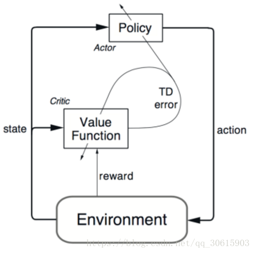
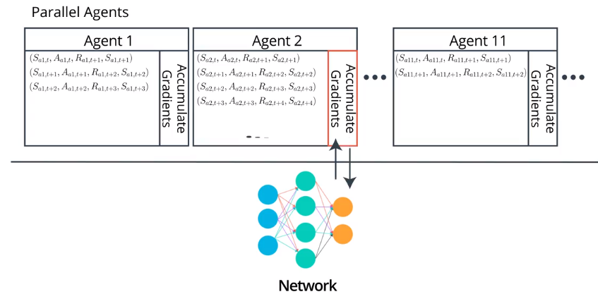
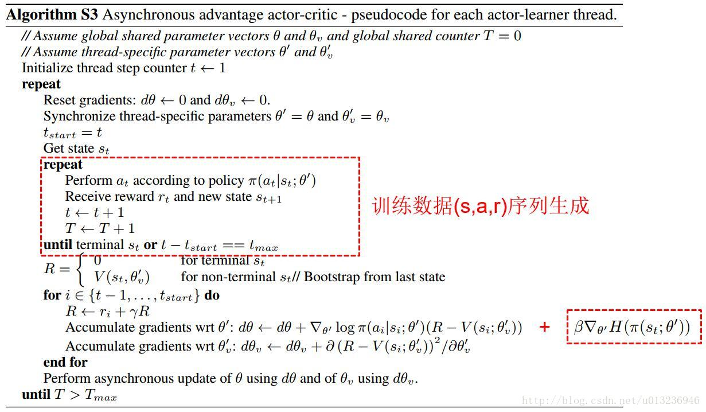

# Actor Critic Methods

使用value-based方法作为baseline,用来减少policy-based方法的variance
#### 估计Expected Return的方法
* Monte-Carlo estimate
  完成episode之后，计算discounted reward
  $$R_t=\sum_{k=0}^{\infin} \gamma R_{t+k+1}$$

  由于每个episode的结果不一样，对于同一个state，估计值有极大的**variant**，但是unbiased
* TD estimate
   $$v_\pi (s) = E_\pi[R_{t+1} + \gamma v_\pi(S_{t+1})|S_t=s]$$

   根据下个state的估计值来计算value，其结果是biased， 但是low variant

#### 主要思路
* 之前的方法，使用Monte Carlo方法去训练baseline，引入了high variant；
在actor-critic中，使用TD estimation去训练baseline，作为Critic。降低了variant，加速了收敛。
* policy-based methods: 在一个trajectory中，可能动作有好有坏，但判断的依据是根据最终的reward，因此该方法有high variant；但是其擅长生成动作
* value-based methods：擅长评估，Q-value
* actor-critic结合两者优势，使用critic更快地判断动作的好坏。比policy-based methods需要更少的sample，比value-based methods更稳定。
  
#### Basic Actor Critic Agent
* Critic
一个估计状态价值的网络,接受S，输出V(s)
$$V_π(s)=E_π[r+\gamma Vπ(s′)]$$
* Actor
估计策略的网络，接受S，输出Action
* 大致流程
    1. actor接受S，生成A
    2. 执行A,得到S',r
    3. 计算critic的target,TD error：
        $$r+\gamma V(s';\theta_v)-V(s;\theta_v)$$
    4. 计算优势函数$A(s,a)$:
        $$A_\pi (s,a)=Q (s,a) -V (s)=r+\gamma V(s';\theta_v)-V (s；\theta_v)$$
    5. 更新actor函数$$g=A_\pi (s_t,a_t) \nabla_{\theta} log \pi_{\theta}(a_t|s_t)$$$$\theta_\pi \leftarrow \theta_\pi + \alpha g$$
    6. 更新critic$$g = \nabla_{\theta_v} (r+\gamma V(s';\theta_v)-V (s；\theta_v))^2$$$$\theta_v \leftarrow \theta_v + \alpha g$$

#### 算法：异步优势actor-critic（Asynchronous advantage actor-critic A3C)
##### N-step Bootstrapping
计算n步长度的TD Error
$$V(s_t)=r_{t+1}+\gamma r_{t+2}+\gamma^2 r_{t+2}+...+\gamma^n V(s_{t+n})=\sum_{i=0}^{n-1} \gamma^i r_{t+i}+\gamma^n V(s_{t+n})$$

优点：减少bias，收敛更快，需要的样本少
缺点：variance大
##### Parallel Training
为了避免经验样本的相关性correlation，DQN使用了replay buffer,但使其成为offline。
这里A3C使用了平行训练的方法：
* 根据同一个网络初始化多个agents，同时在不同的环境下交互
* 对于每个agent，采集长度为n的trajectory，相当于进行n-step boostrapping. 然后计算$d\theta$,用其更新全局网络。因为每个agent更新时间不同时，所以称为异步
* agent复制全局网络，重复以上步骤  

优点：
* online
* 减少了内存的占用  

##### Loss Function
$$L =L_\pi +L_v+L_{reg}$$

最大化reward，所以前面加负号，使用梯度下降法。
$$L_\pi =-\frac{1}{n} \sum_i^n A_\pi (s_t,a_t) log \pi_{\theta}(a_t|s_t)$$

$$L_v =\frac{1}{n} \sum_i^n \sum_{i=0}^{n-1} \gamma^i r_{t+i}+\gamma^n V(s_{t+n};\theta_v)-V (s；\theta_v)$$

引入正则项，平衡探索和利用，使所有动作都有机会。所以最大化entropy，等于最小化-entropy。$$L_{reg}= -\frac{1}{n} \sum_i^n\beta H(\pi(s_t;\theta_\pi))$$

图中为 **$t_{max}$ TD error**
[代码参考](https://github.com/ikostrikov/pytorch-a3c)
