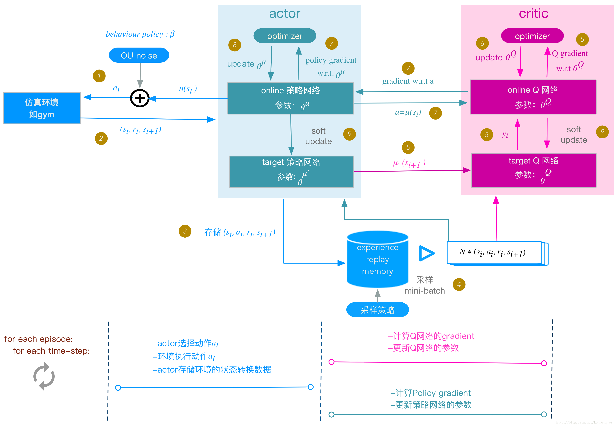

## Deep Deterministic Policy Gradient (DDPG) 
#### Deterministic Policy Gradient
* 结合了actor-critic和DQN结构,拥有replay buffer
* 使用deterministic policy

##### Deterministic Policy Gradient
直观上来说，我们应该朝着使得值函数Q值增大的方向去更新策略的参数θ,因此算法根据state value来更新policy，所以：
$$g=\nabla_\theta Q_w(s, \pi_\theta (s))$$

根据链式法则：
$$g=\nabla_a Q_w(s, a) \nabla_\theta \pi_\theta (s)$$  
##### loss function
假设：
critic网络：$Q(s,a|\theta^Q)$
critic target网络：$Q(s,a|\theta^{Q'})$
actor网络：$\mu(s|\theta^\mu)$
actor target网络：$\mu(s|\theta^{\mu'})$

对于critic：
$$Loss = \frac {1}{N} \sum^N_i [r_i+\gamma Q'(s_{i+1}, \mu'(s_{i+1}|\theta^{\mu'})| \theta^{Q'})-Q(s_i,a_i| \theta^Q)]^2$$
对于actor：
$$\nabla_{\theta^\mu J} \approx \frac {1}{N} \sum^N_i \nabla_a Q(s, a|\theta^Q) \nabla_{\theta^\mu} \mu (s|\theta^\mu )$$
##### 动作随机噪声
* 为了平衡exploration和exploit，ddpg使用了Uhlenbeck-Ornstein随机过程（下面简称UO过程），作为引入的随机噪声
* UO过程在时序上具备很好的相关性，可以使agent很好的探索具备动量属性的环境exploration的目的是探索潜在的更优策略，
* 为action的决策机制引入随机噪声  
$$action = \mu(s)+Noise$$

##### Soft-update
不同与DQN直接将训练网络与目标网络直接复制，DDPG使用了一种缓慢更新的方法，每次只复制一小部分。
$$\theta = \tau \theta + (1-\tau)\theta'$$

##### 算法流程

[代码参考](https://github.com/udacity/deep-reinforcement-learning)