# 1. LeNet-5
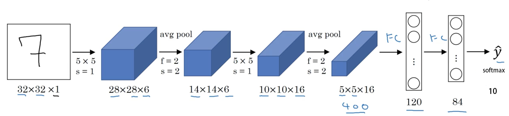
模型特性：
- 卷积网络使用一个3层的序列组合：卷积、下采样（池化）、非线性映射（LeNet-5最重要的特性，奠定了目前深层卷积网络的基础）
- 使用卷积提取空间特征
- 使用映射的空间均值进行下采样 average pooling
- 使用$tanh$或$sigmoid$进行非线性映射
- 多层神经网络（MLP）作为最终的分类器

# 2. AlexNet

模型特性
- 所有卷积层都使用ReLU作为非线性映射函数，使模型收敛速度更快
- 在多个GPU上进行模型的训练，不但可以提高模型的训练速度，还能提升数据的使用规模（group convolution)
- 使用LRN对局部的特征进行归一化，结果作为ReLU激活函数的输入能有效降低错误率（事实证明没什么用）
- 重叠最大池化（overlapping max pooling），即池化范围z与步长s存在关系$z>s$（如$S_{max}$中核尺度为$3\times3/2$），避免平均池化（average pooling）的平均效应
- 使用数据增强
- 使用dropout　选择性地忽略训练中的单个神经元，避免模型的过拟合　

# 3. ZFNet
ZFNet第一层卷积采用了7×7×3/2的卷积核替代了AlexNet中第一层卷积核11×11×3/4的卷积核  

模型特性
ZFNet与AlexNet在结构上几乎相同，此部分虽属于模型特性，但准确地说应该是ZFNet原论文中**可视化技术**的贡献。

- 可视化技术揭露了激发模型中每层单独的特征图。
- 可视化技术允许观察在训练阶段特征的演变过程且诊断出模型的潜在问题。
- 可视化技术用到了多层转置卷积网络，即由特征激活返回到输入像素空间。
- 可视化技术进行了分类器输出的敏感性分析，即通过阻止部分输入图像来揭示那部分对于分类是重要的。
- 可视化技术提供了一个非参数的不变性来展示来自训练集的哪一块激活哪个特征图，不仅需要裁剪输入图片，而且自上而下的投影来揭露来自每块的结构激活一个特征图。
- 可视化技术依赖于转置卷积操作，逆池化。

逆池化：池化操作是非可逆的，但是我们、、可以通过记录最大值的位置来获得一个近似逆。非池化操作使用这些转换来放置上述最大值的位置，保存激活的位置，其余位置都置0。
Relu：卷积网中使用非线性的ReLU来修改特征图来确保特征图总是正值。为了获得在每层的有效（也应该是正值）的特征重建，也在转置卷积网中利用了ReLU。

# 4. Network in Network
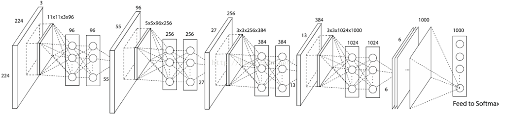
### 创新点
### 4.1 MLP Convolution Layers　（卷积＋ｍｌｐ）
卷积通过线性滤波器对应特征图位置相乘并求和，然后进行非线性激活得到特征图,线性模型足以抽象线性可分的隐含特征，但是实际上这些特征通常是高度非线性的，常规的卷积网络则可以通过采用一组超完备滤波器（尽可能多）提取统一潜在特征各种变体（宁可错杀一千不可放过一个），但是同一潜在特征使用太多的滤波器会给下一层带来额外的负担，需要考虑来自前一层的所有变化的组合，来自更高层的滤波器会映射到原始输入的更大区域，它通过结合下层的较低级概念生成较高级的特征，因此作者认为网络局部模块做出更好的特征抽象会更好
由于隐含概念的分布一开始并不知道，所以用一个通用函数逼近器做局部块的特征提取，因为它能逼近隐含概念的更多抽象表示。这里使用多层感知器，有两个原因：
首先，多层感知器与卷积神经网络的结构一样，都是通过反向传播训练。
其次多层感知器本身就是一个深度模型，符合特征再利用的精神。这种多层感知器层在文本被称作mlpconv

mlp细节：
输入为一个feature map, 输出为一个feature map 时：
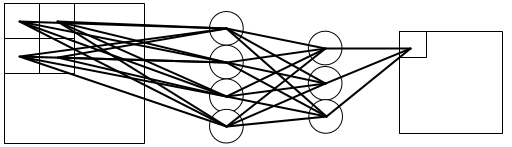
输入为多个feature map, 输出为一个feature map 时：
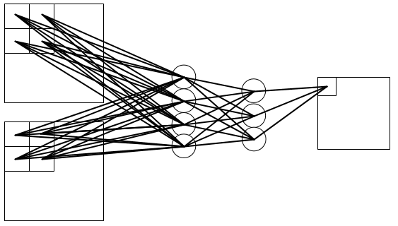
输入为多个feature map, 输出为多个feature map 时：
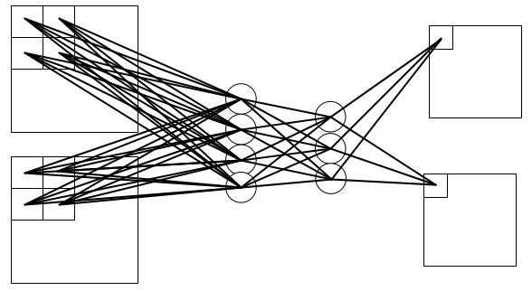

在 卷积神经网络中，无论是输入还是输出，不同的 feature map 之间的卷积核是不相同的；
在mlpconv中，不同的 feature map 之间的开头与能结尾之间的权值不一样，而在 隐含层之间的权值是共享的；
其本质是一个**1x1卷积**,其作为NIN函数逼近器基本单元，除了增强了网络局部模块的抽象表达能力外，在现在看来还可以实现跨通道特征融合和通道升维降维

### 4.2 Global Average Pooling
对最后一层的特征图进行平均池化，得到的结果向量直接输入softmax层
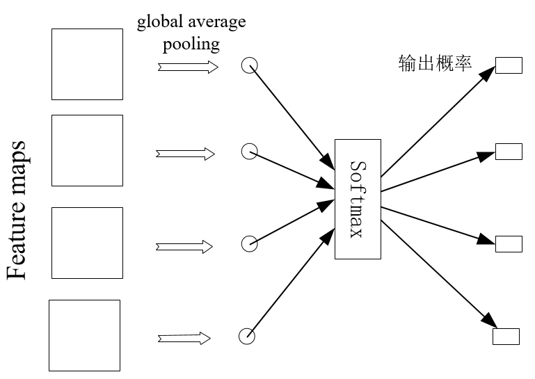
通过增强特征图与类比间的对应关系使卷积结构保留的更好，使特征图分类是可信的得到很好的解释，使得特征图与分类任务直接关联，
汇聚了空间信息，所以对输入的空间转换更鲁棒
另一个优点是全局平均池化不需要优化额外的模型参数，因此模型大小和计算量较全连接大大减少，并且可以避免过拟合(全连接层参数多，容易过拟合)

## 5. VGG
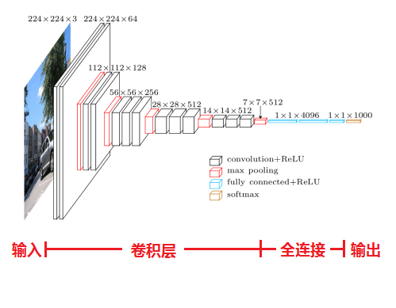

C型架构中的1*1卷积的意义主要在于线性变换，而输入通道数和输出通道数不变，没有发生降维（增加决策函数的非线性且不会影响到感受野的大小）　　

特点：
1. 结构简洁 
VGG由5层卷积层、3层全连接层、softmax输出层构成，层与层之间使用max-pooling（最大化池）分开，所有隐层的激活单元都采用ReLU函数
2. 小卷积核和多卷积子层
VGG使用多个较小卷积核（3x3）的卷积层代替一个卷积核较大的卷积层，一方面可以**减少参数**，另一方面相当于进行了**更多的非线性映射，可以增加网络的拟合/表达能力**。两个3x3的卷积堆叠获得的感受野大小，相当一个5x5的卷积；而3个3x3卷积的堆叠获取到的感受野相当于一个7x7的卷积
3. 小池化核
全部采用2x2的池化核。
4. 层数更深、特征图更宽　　

训练：
1. 使用mini-batch的梯度下降法，并且是带动量的。batch_size设置为256，动量是0.9。
2. 前两个全连接使用了dropout，值是0.5, 用来缓解过拟合。
3. 学习率初始设置为0.01，衰减系数为10，每当验证集上准确率不再变好时，会降低学习率。学习率一共被衰减3次。总共训练了74个epoch，370k个iteration。
参数初始化：
1. 先训练上面网络结构中的A结构，A收敛之后呢，将A的网络权重保存下来，再复用A网络的权重来初始化后面几个简单模型。
2. 复用A的网络权重，只是前四个卷积层，以及后三层全连接层，其它的都是随机初始化。
3. 随机初始化，均值是0，方差是0.01。bias是0.  

图片预处理：
模型输入为224*224,需要裁剪
1. 作者进行了两种方法的来构建训练集图像：
S为图片最小边的长度
    - 从固定尺寸的图像上选取224*224的crop，尺寸有两种，一种是S = 384，一种是S = 256；
    - 原始训练集图像的尺寸不固定，范围在$S∈[256,512]$ ，然后再crop 224*224的图像块，这种方法也可以看作是尺度变化进行图像增广的方法－－尺度抖动　
2. 随机剪裁(每SGD一次)
3. 随机水平翻转
4. RGB颜色偏移

测试：
1. 测试时先将网络转化为全卷积网络，第一个全连接层转为7×7的卷积层，后两个全连接层转化为1×1的卷积层。结果得到的是一个N×N×M的结果，称其为类别分数图，其中M等于类别个数，N的大小取决于输入图像尺寸Q，计算每个类别的最终得分时，将N×N上的值求平均，此时得到1×1×M的结果，此结果即为最终类别分数，这种方法文中称为密集评估。这样替换全连接层，就相当于将全连接层应用到了整个未剪裁的图片中，而且得到一个类别的得分图，其通道数等于类别数。

2. 我们还通过水平翻转图像来增强测试集，运用原始图片的softmax的后验概率以及其水平翻转的平均来获得图片的得分。

总结：
1. 通过增加深度能有效地提升性能；
2. 最佳模型：VGG16，从头到尾只有3x3卷积与2x2池化，简洁优美(对应模型Ｄ)；
3. VGG耗费更多计算资源，并且使用了更多的参数（这里不是3x3卷积的锅）。其中绝大多数的参数都是来自于全连接层。  

## 6. GoogLeNet
#### 6.1 Inception V1

在3x3前、5x5前、max pooling后分别加上了1x1的卷积核，以起到了降低特征图厚度的作用
每个分支的图像大小相同，最后将所有的通道叠加

1. 采用了模块化的结构（Inception结构），方便增添和修改；
2. 网络最后采用了average pooling（平均池化）来代替全连接层，该想法来自NIN（Network in Network），事实证明这样可以将准确率提高0.6%。但是，实际在最后还是加了一个全连接层，主要是为了方便对输出进行灵活调整；
3. 虽然移除了全连接，但是网络中依然使用了Dropout；

#### 6.2 Inception V2

前提：
- 减少representational bottleneck。当卷积层快速的减少图像大小时，会造成信息丢失(representational bottleneck)

解决
- 分解5x5卷积，变成两个3x3卷积（根据ＶＧＧ论文）
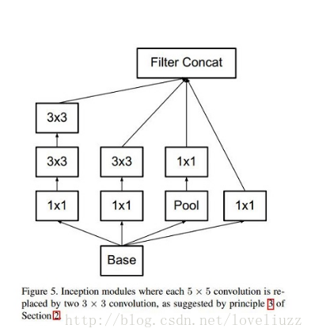
- 任意nxn的卷积都可以通过1xn卷积后接nx1卷积来替代
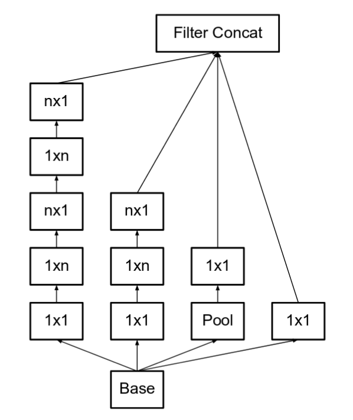
- 使用加宽的moudule, 防止representational bottleneck
  

#### 6.3 Inception V3
解决：
- 使用了BatchNorm
- 使用分解化的7x7卷积(Factorized 7x7 convolutions)  
- Label smooth.一种使用在loss　function上的正则化项，使网络不对某一个种类输出过分自信的值，防止过拟合　　

#### 6.４ Inception V４
改进：
- 修改‘蒸馏’过程(在进入inception module之前的所有步骤)
 
The top image is the stem of Inception-ResNet v1. The bottom image is the stem of Inception v4 and Inception-ResNet v2.
- 主要使用了三个modules
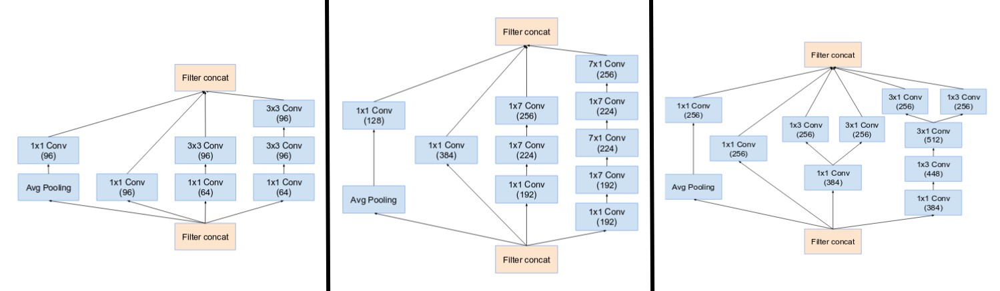 
- 新的pooling层, specialized “Reduction Blocks” ，防止信息丢失
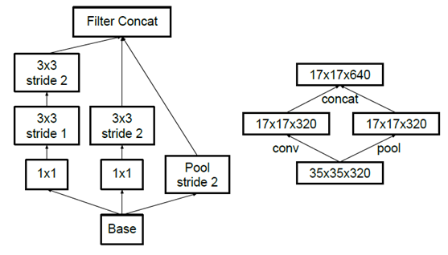
利用了两个并行的结构完成size reduction，分别是conv和pool，上图的右半部分。左半部分是右半部分的内部结构  
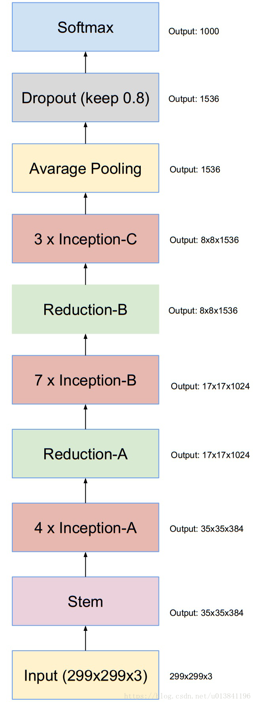 
#### 6.5 Inception-ResNet v1
inception-resnet v1网络主要被用来与inception v3模型性能进行比较。因此它所用的inception子网络的计算相对常规inception模块有所减少，这是为了保证使得它的整体计算/内存开销与inception v3近似，如此才能保证比较的公平性
   

#### 6.6 Inception-ResNet v2
相对于inception-resnet v1而言，v2主要被设计来探索residual learning用于inception网络时所极尽可能带来的性能提升。因此它所用的inception 子网络并没有像v1中用的那样偷工减料。
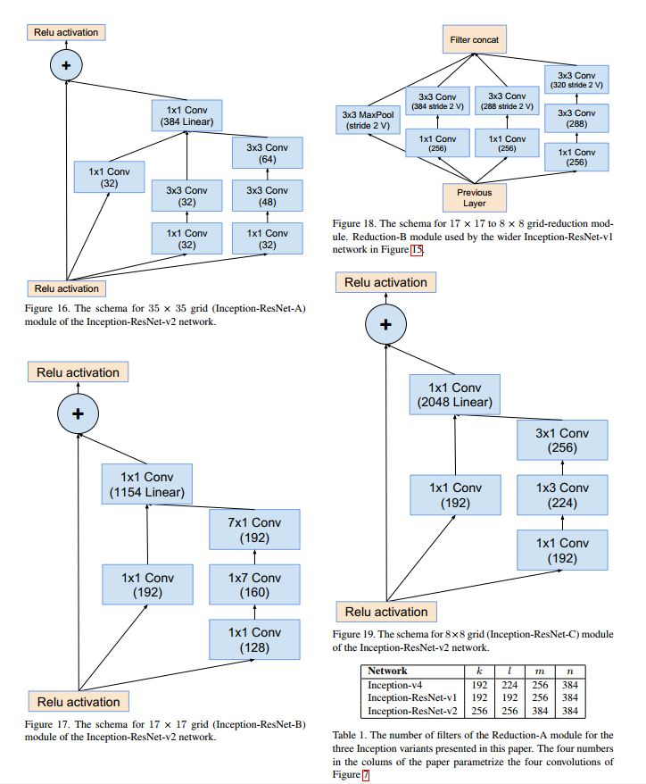  

## 7. ResNet
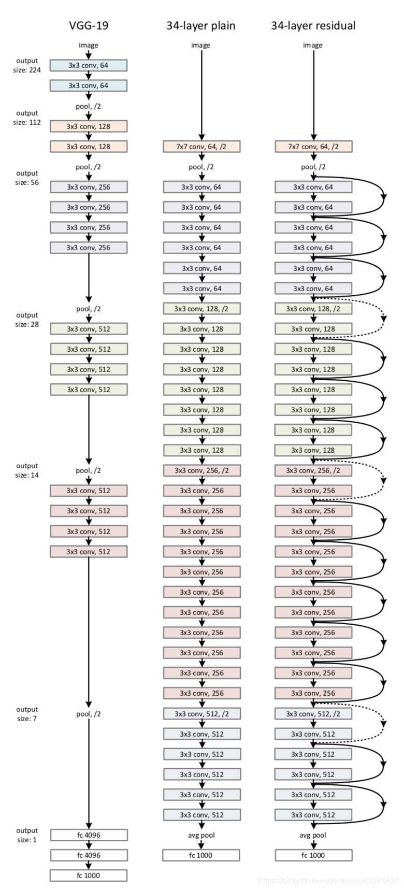
解决问题：
- 增加深度带来的首个问题就是梯度爆炸/消散的问题，这是由于随着层数的增多，在网络中反向传播的梯度会随着连乘变得不稳定，变得特别大或者特别小。这其中经常出现的是梯度消散的问题。
- 为了克服梯度消散也想出了许多的解决办法，如使用BatchNorm，将激活函数换为ReLu，使用Xaiver初始化等，可以说梯度消散已经得到了很好的解决
- Degradation of deep network，即随着深度的增加，网络的性能会越来越差，直接体现为在训练集上的准确率会下降,不是overfitting

#### Residual Module
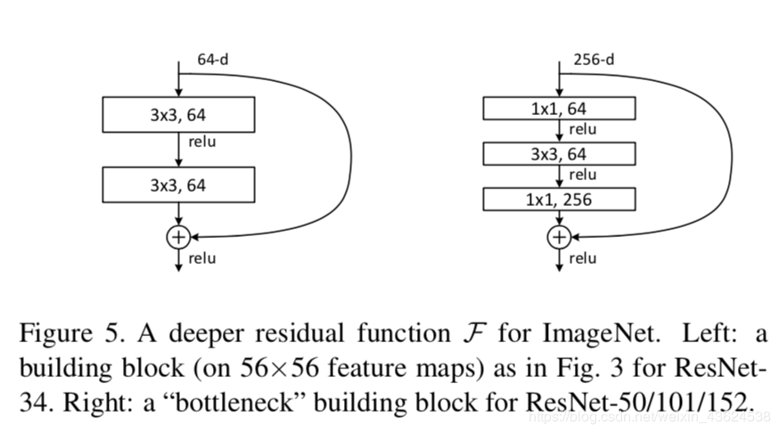
上图左为basic形式，右为bottleneck的形式(减少计算)。 

思想：
1. 直接对网络进行简单的堆叠到特别长，网络内部的特征在其中某一层已经达到了最佳的情况，这时候剩下层应该不对改特征做任何改变，自动学成恒等映射(identity mapping) 的形式。也就是说，相对于浅层网络更深的网络至少不会有更差的效果，但是因为网络degradation的问题，这并不成立。
2. 退而求其次，已知有网络degradation的情况下，不求加深度能提高准确性，能不能至少让深度网络实现和浅层网络一样的性能，即让深度网络后面的层至少实现恒等映射的作用，根据这个想法，作者提出了residual模块来帮助网络实现恒等映射。　

作用：
- F(x)=H(x)−x，x为浅层的输出，H(x)为深层的输出,当浅层的x代表的特征已经足够成熟，如果任何对于特征x的改变都会让loss变大的话，F(x)会自动趋向于学习成为0，x则从恒等映射的路径继续传递.在前向过程中，当浅层的输出已经足够成熟（optimal），让深层网络后面的层能够实现恒等映射的作用。

- 因此redidual模块会明显减小模块中参数的值从而让网络中的参数对反向传导的损失值有更敏感的响应能力，虽然根本上没有解决回传的损失小得问题，但是却让参数减小，相对而言增加了回传损失的效果，也产生了一定的正则化作用.[参考](https://blog.csdn.net/weixin_43624538/article/details/85049699).
- 因为前向过程中有恒等映射的支路存在，因此在反向传播过程中梯度的传导也多了更简便的路径

使用：
当进行add操作时，需要对应的depth进行相加，有可能深度不相同，这时候有两种identity mapping的方式：
一种即简单地将X相对Y缺失的通道直接补零从而使其能够相同
另一种则是通过使用1x1卷积

#### residual module改进
$$y_l=h(x_l)+F(x_l,W_l)$$

$$x_{l+1}=f(y_l)$$

为了整个网络信息的传播构造一个流畅的通道，如果：
$$h(x_l)=x_l$$

$$x_{l+1}=y$$

则有：
$$x_L=x_l+\sum_{i=l}^{L-1} F(x_i,W_i)$$

改进后网络的反向传播公式如下：
$$\frac{\partial l}{\partial x_l}=\frac{\partial l}{\partial x_L}\frac{\partial L}{\partial x_l}=\frac{\partial l}{\partial x_L}(1+\frac{\partial l}{\partial x_l}\sum_{i=l}^{L-1} F(x_i,W_i))$$

对于任何一层的x的梯度由两部分组成，其中一部分直接就由L层不加任何衰减和改变的直接传导l层，这保证了梯度传播的有效性,另一部分也由链式法则的累乘变为了累加，这样有更好的稳定性.
以上优秀的特点只有在假设成立时才有效，所以ResNet要尽量保证两点：
1）不轻易改变”identity“分支的值，也就是输入与输出一致；
2）addition之后不再接改变信息分布的层.  
#### 残差模块的几种可能的设置
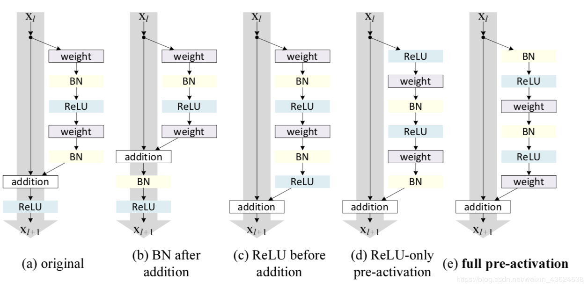
图１是ｒｅｓｎｅｔ原始结构，图２和图１都改变了identity map的值，为了去掉relu，有以下几种做法：
- 把relu放回参数层F中，如上图３，但这样会让F中拟合的对于x的残差只有正值，会大大减小残差的表示性。
- 文章提出了一种叫pre-activation的方式，即把BN和relu放在卷积的前面，这样就可以保证F中所有的操作都在和x相加之前完成，并且不会对残差产生限制，上图中的(e)。实际上把激活层（relu+BN）放在卷积的前面的操作在VGG等网络中不会产生不同的影响，但是在残差网络中就可以保证输入和输出加和之后在输入下一层之前没有别的操作，让整个信息的前向后向流动没有任何阻碍，从而让模型的优化更加简单和方便。
- 对于(d)这种只把relu提前的操作也会产生问题，当F中经过最后一个BN后，还要经过一个和x相加的运算，本来BN就是为了给数据一个固定的分布，一旦经过别的操作就会改变数据的分布，会削减BN的作用。在原版本的resnet中就是这么使用的BN，所以这种pre-activation的方式也增加了残差模块的正则化作用
- 通常把图5的结构称作**ResNet V2**  

### 7.1 ResneXt
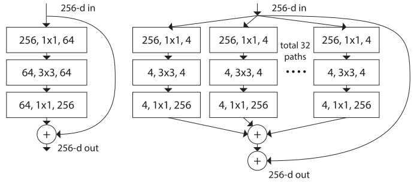
网络性能提升的关键在于残差模块，而不是shortcut，ResNeXt基于wide residual和inception，提出了另一个方向，即将残差模块中的所有通道分组进行汇合操作会有更好的效果。

因为每个分支的**相同结构**，提出除了深度和宽度之外的第三维度**cardinality**，即分支的数量,是一个比深度和宽度更加有效的维度（上图右侧cardinality为３２）

上图为三种相同的形式

### 7.2 Deep Network with Stochastic depth
背景：
1. 更深层的网络通常需要进行数周的训练——因此，把它应用在实际场景下的成本非常高
2. 在训练过程中，随机去掉很多层，并没有影响算法的收敛性，说明了ResNet具有很好的冗余性。而且去掉中间几层对最终的结果也没什么影响，说明ResNet每一层学习的特征信息都非常少，也说明了ResNet具有很好的冗余

思想：
1. 在训练的过程中，每一个层都有一个“生存概率”，并且都会被任意丢弃。在测试过程中，所有的block都将保持被激活状态，而且block都将根据其在训练中的生存概率进行调整
2. 在训练中，如果一个特定的残差块被启用了，那么它的输入就会同时流经恒等转换（identity shortcut）和权重层；否则输入就只会流经恒等变换shortcut
3. 使用一个“线性衰减规律”应用于每一层的生存概率。由于较早的层会提取低级特征，而这些低级特征会被后面的层所利用，所以这些层不应该频繁地被丢弃
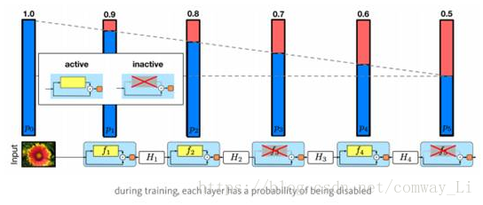

优点：
1、这种方法成功地解决了深度网络的训练时间难题。

2、它大大减少了训练时间，并显着改善了几乎所有数据集的测试错误（CIFAR-10，CIFAR-100，SVHN）

3、可以使得网络更深

## 8. DenseNet
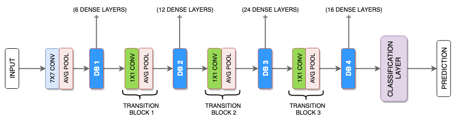
使用了dense block，在其中，对于每一层，使用前面所有层的特征映射作为输入，并且使用其自身的特征映射作为所有后续层的输入。

优点: 缓解了消失梯度问题，加强了特征传播，鼓励特征重用，并大大减少了参数的数量

#### 8.1 Dense connections
每个层从前面的所有层获得额外的输入，并将自己的特征映射传递到后续的所有层。使用concatenation拼接输入(在resnet中使用add操作)

- 使collective knowledge(网络学习到的特征)可以复用
- 网络无需更多冗余的特征图，可以减少层数，减少参数，加快训练
- 隐性深度监督Implicit Deep Supervision.使每一层可以直接访问ｌｏｓｓ梯度和原始输入，更好的使梯度传递。网络顶部的单个分类器通过最多两个或三个过渡层对所有层提供直接监控。然而，由于所有层之间共享相同的损耗函数，因此DenseNets的损耗函数和梯度基本上不那么复杂
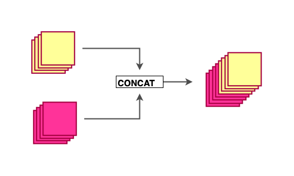
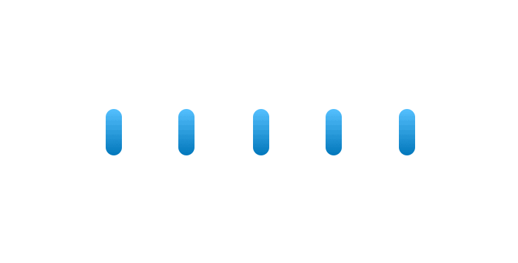

#### 8.2 Composite function
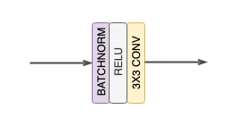
文章中，定义了一种组合的函数,
以下所有的conv表示为：
BatchNorm→ReLU→Conv*

#### 8.3 Dense block
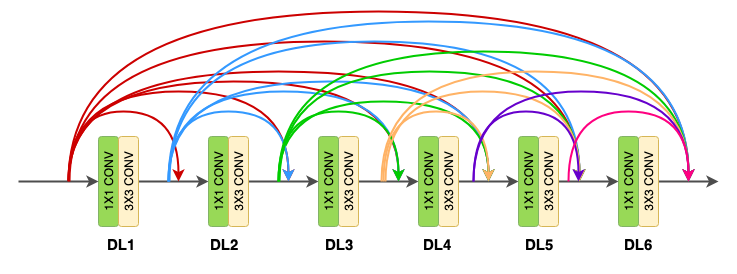
每个block由多个dense layer组成，之间使用稠密连接（使用前面所有层的特征映射作为输入，并且使用其自身的特征映射作为所有后续层的输入）。

在block中，所有的feature map的大小不变

#### 8.4 Dense layer
原始的，每个dense layer由一部分组成：
- 3 X 3 CONV

**Bottleneck layers**
虽然每一层只产生k个输出特征映射，但它通常具有更多的输入，为了减少dense layer输出的深度,并将具有瓶颈层的网络称为**DenseNet-B**
- １ X １ CONV（输出深度为4k)
- 3 X 3 CONV
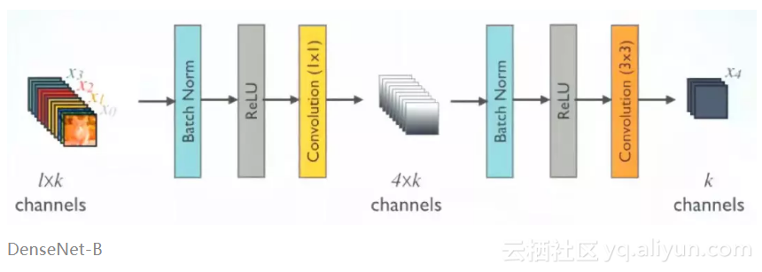

输出的depth为定值，等于**growth rate k**
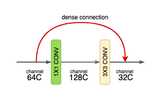

#### 8.5 Growth rate (k)
每个dense layer输出的深度

按顺序，对于每一个layer,其输入深度都会增加k个
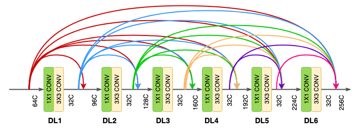

一个较小的k值，就可以得到好的表现。对此的一种解释是每个层可以访问其块中的所有前面的特征映射，因此可以访问网络的“集体知识”。人们可以将特征映射看作网络的全局状态。每个层将自己的 k 个特征映射添加到这个状态。增长速度控制着每一层新信息对全局状态的贡献。全局状态一旦写入，就可以从网络内的任何地方访问，并且与传统网络体系结构不同，不需要逐层复制它

#### 8.6 Transition layer
在dense block之间的层。两部分组成：
- 1 X 1 CONV　（降维）
- ２ X ２ AVG POOL　（downsampling）
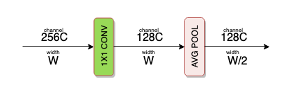
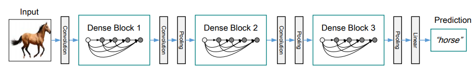

**Compression**
为了进一步提高模型的紧凑性，可以通过过渡层减少特征映射的数量。如果一个dense block包含 m 个特征映射，可以让紧跟着的变化层生成 ⌊θm⌋个输出特征映射， 0<θ≤1作为压缩因子。当 θ<1 时，网络称为**DenseNet-C**

[代码参考](https://towardsdatascience.com/paper-review-densenet-densely-connected-convolutional-networks-acf9065dfefb)

# 其他
[网络模型结构可视化网站](https://dgschwend.github.io/netscope/quickstart.html)

其他网络：
Highway Networks
Fractal Nets
Deeply Supervised Network
Ladder Networks
Deeply-Fused Nets

