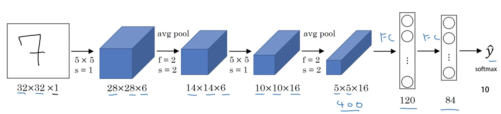
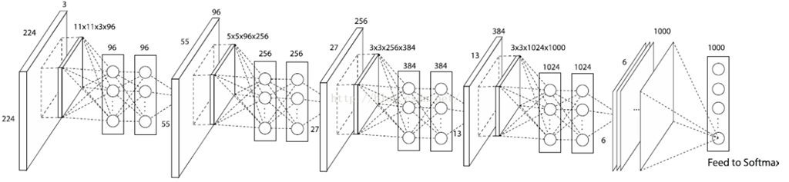
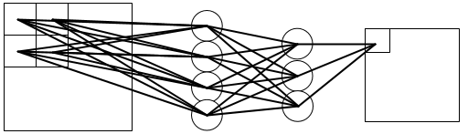
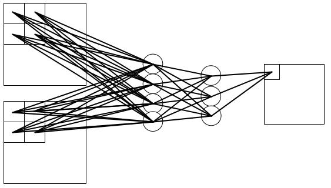
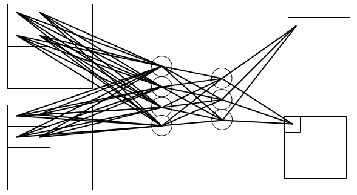
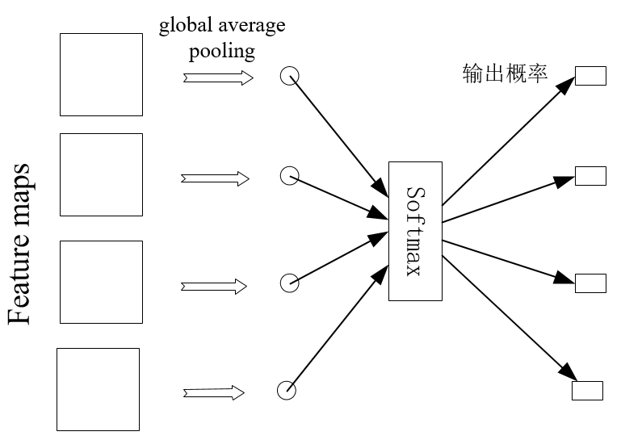
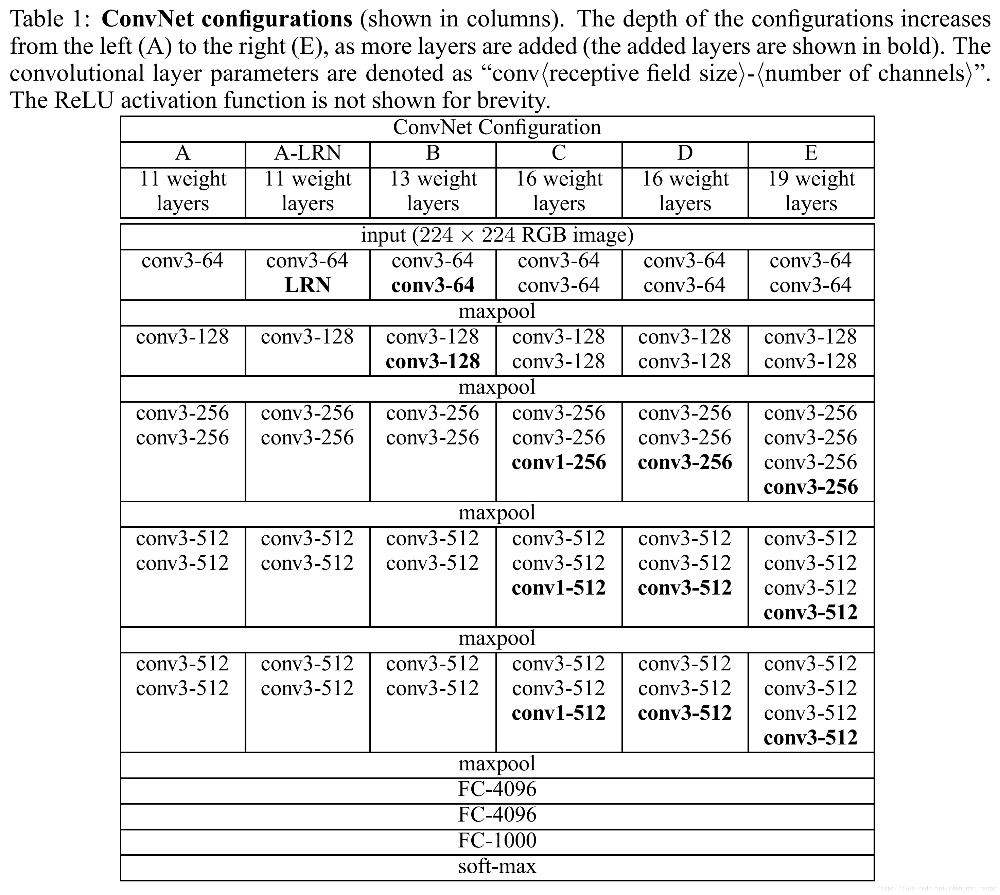
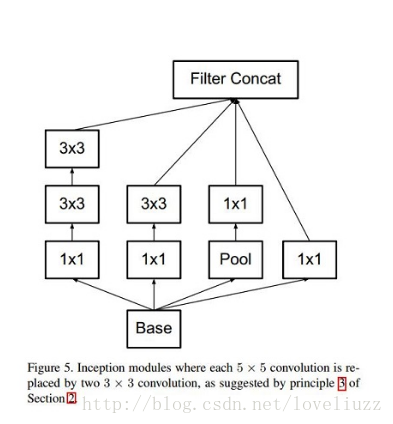
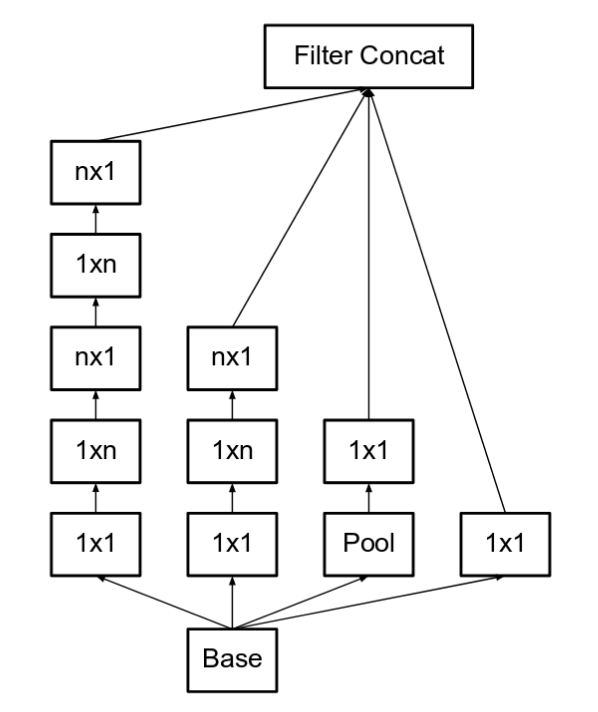
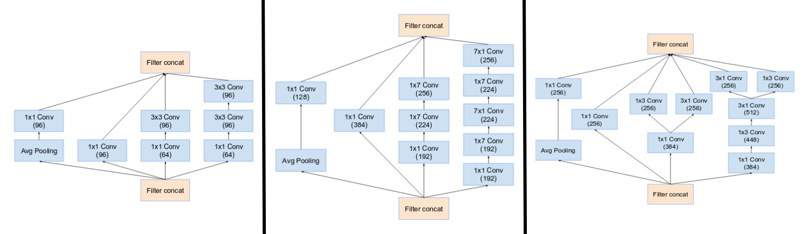

# 1. LeNet-5

模型特性：
- 卷积网络使用一个3层的序列组合：卷积、下采样（池化）、非线性映射（LeNet-5最重要的特性，奠定了目前深层卷积网络的基础）
- 使用卷积提取空间特征
- 使用映射的空间均值进行下采样 average pooling
- 使用$tanh$或$sigmoid$进行非线性映射
- 多层神经网络（MLP）作为最终的分类器

# 2. AlexNet

模型特性
- 所有卷积层都使用ReLU作为非线性映射函数，使模型收敛速度更快
- 在多个GPU上进行模型的训练，不但可以提高模型的训练速度，还能提升数据的使用规模（group convolution)
- 使用LRN对局部的特征进行归一化，结果作为ReLU激活函数的输入能有效降低错误率（事实证明没什么用）
- 重叠最大池化（overlapping max pooling），即池化范围z与步长s存在关系$z>s$（如$S_{max}$中核尺度为$3\times3/2$），避免平均池化（average pooling）的平均效应
- 使用数据增强
- 使用dropout　选择性地忽略训练中的单个神经元，避免模型的过拟合　

# 3. ZFNet
ZFNet第一层卷积采用了7×7×3/2的卷积核替代了AlexNet中第一层卷积核11×11×3/4的卷积核  

模型特性
ZFNet与AlexNet在结构上几乎相同，此部分虽属于模型特性，但准确地说应该是ZFNet原论文中**可视化技术**的贡献。

- 可视化技术揭露了激发模型中每层单独的特征图。
- 可视化技术允许观察在训练阶段特征的演变过程且诊断出模型的潜在问题。
- 可视化技术用到了多层转置卷积网络，即由特征激活返回到输入像素空间。
- 可视化技术进行了分类器输出的敏感性分析，即通过阻止部分输入图像来揭示那部分对于分类是重要的。
- 可视化技术提供了一个非参数的不变性来展示来自训练集的哪一块激活哪个特征图，不仅需要裁剪输入图片，而且自上而下的投影来揭露来自每块的结构激活一个特征图。
- 可视化技术依赖于转置卷积操作，逆池化。

逆池化：池化操作是非可逆的，但是我们、、可以通过记录最大值的位置来获得一个近似逆。非池化操作使用这些转换来放置上述最大值的位置，保存激活的位置，其余位置都置0。
Relu：卷积网中使用非线性的ReLU来修改特征图来确保特征图总是正值。为了获得在每层的有效（也应该是正值）的特征重建，也在转置卷积网中利用了ReLU。

# 4. Network in Network

### 创新点
### 4.1 MLP Convolution Layers　（卷积＋ｍｌｐ）
卷积通过线性滤波器对应特征图位置相乘并求和，然后进行非线性激活得到特征图,线性模型足以抽象线性可分的隐含特征，但是实际上这些特征通常是高度非线性的，常规的卷积网络则可以通过采用一组超完备滤波器（尽可能多）提取统一潜在特征各种变体（宁可错杀一千不可放过一个），但是同一潜在特征使用太多的滤波器会给下一层带来额外的负担，需要考虑来自前一层的所有变化的组合，来自更高层的滤波器会映射到原始输入的更大区域，它通过结合下层的较低级概念生成较高级的特征，因此作者认为网络局部模块做出更好的特征抽象会更好
由于隐含概念的分布一开始并不知道，所以用一个通用函数逼近器做局部块的特征提取，因为它能逼近隐含概念的更多抽象表示。这里使用多层感知器，有两个原因：
首先，多层感知器与卷积神经网络的结构一样，都是通过反向传播训练。
其次多层感知器本身就是一个深度模型，符合特征再利用的精神。这种多层感知器层在文本被称作mlpconv

mlp细节：
输入为一个feature map, 输出为一个feature map 时：

输入为多个feature map, 输出为一个feature map 时：

输入为多个feature map, 输出为多个feature map 时：

在 卷积神经网络中，无论是输入还是输出，不同的 feature map 之间的卷积核是不相同的；
在mlpconv中，不同的 feature map 之间的开头与能结尾之间的权值不一样，而在 隐含层之间的权值是共享的；
其本质是一个**1x1卷积**,其作为NIN函数逼近器基本单元，除了增强了网络局部模块的抽象表达能力外，在现在看来还可以实现跨通道特征融合和通道升维降维

### 4.2 Global Average Pooling
对最后一层的特征图进行平均池化，得到的结果向量直接输入softmax层

通过增强特征图与类比间的对应关系使卷积结构保留的更好，使特征图分类是可信的得到很好的解释，使得特征图与分类任务直接关联，
汇聚了空间信息，所以对输入的空间转换更鲁棒
另一个优点是全局平均池化不需要优化额外的模型参数，因此模型大小和计算量较全连接大大减少，并且可以避免过拟合(全连接层参数多，容易过拟合)

## 5. VGG

C型架构中的1*1卷积的意义主要在于线性变换，而输入通道数和输出通道数不变，没有发生降维（增加决策函数的非线性且不会影响到感受野的大小）　　

特点：
1. 结构简洁 
VGG由5层卷积层、3层全连接层、softmax输出层构成，层与层之间使用max-pooling（最大化池）分开，所有隐层的激活单元都采用ReLU函数
2. 小卷积核和多卷积子层
VGG使用多个较小卷积核（3x3）的卷积层代替一个卷积核较大的卷积层，一方面可以**减少参数**，另一方面相当于进行了**更多的非线性映射，可以增加网络的拟合/表达能力**。两个3x3的卷积堆叠获得的感受野大小，相当一个5x5的卷积；而3个3x3卷积的堆叠获取到的感受野相当于一个7x7的卷积
3. 小池化核
全部采用2x2的池化核。
4. 层数更深、特征图更宽　　

训练：
1. 使用mini-batch的梯度下降法，并且是带动量的。batch_size设置为256，动量是0.9。
2. 前两个全连接使用了dropout，值是0.5, 用来缓解过拟合。
3. 学习率初始设置为0.01，衰减系数为10，每当验证集上准确率不再变好时，会降低学习率。学习率一共被衰减3次。总共训练了74个epoch，370k个iteration。
参数初始化：
1. 先训练上面网络结构中的A结构，A收敛之后呢，将A的网络权重保存下来，再复用A网络的权重来初始化后面几个简单模型。
2. 复用A的网络权重，只是前四个卷积层，以及后三层全连接层，其它的都是随机初始化。
3. 随机初始化，均值是0，方差是0.01。bias是0.  

图片预处理：
模型输入为224*224,需要裁剪
1. 作者进行了两种方法的来构建训练集图像：
S为图片最小边的长度
    - 从固定尺寸的图像上选取224*224的crop，尺寸有两种，一种是S = 384，一种是S = 256；
    - 原始训练集图像的尺寸不固定，范围在$S∈[256,512]$ ，然后再crop 224*224的图像块，这种方法也可以看作是尺度变化进行图像增广的方法－－尺度抖动　
2. 随机剪裁(每SGD一次)
3. 随机水平翻转
4. RGB颜色偏移

测试：
1. 测试时先将网络转化为全卷积网络，第一个全连接层转为7×7的卷积层，后两个全连接层转化为1×1的卷积层。结果得到的是一个N×N×M的结果，称其为类别分数图，其中M等于类别个数，N的大小取决于输入图像尺寸Q，计算每个类别的最终得分时，将N×N上的值求平均，此时得到1×1×M的结果，此结果即为最终类别分数，这种方法文中称为密集评估。这样替换全连接层，就相当于将全连接层应用到了整个未剪裁的图片中，而且得到一个类别的得分图，其通道数等于类别数。

2. 我们还通过水平翻转图像来增强测试集，运用原始图片的softmax的后验概率以及其水平翻转的平均来获得图片的得分。

总结：
1. 通过增加深度能有效地提升性能；
2. 最佳模型：VGG16，从头到尾只有3x3卷积与2x2池化，简洁优美(对应模型Ｄ)；
3. VGG耗费更多计算资源，并且使用了更多的参数（这里不是3x3卷积的锅）。其中绝大多数的参数都是来自于全连接层。  

## 6. GoogLeNet
#### 6.1 Inception V1

在3x3前、5x5前、max pooling后分别加上了1x1的卷积核，以起到了降低特征图厚度的作用
每个分支的图像大小相同，最后将所有的通道叠加

1. 采用了模块化的结构（Inception结构），方便增添和修改；
2. 网络最后采用了average pooling（平均池化）来代替全连接层，该想法来自NIN（Network in Network），事实证明这样可以将准确率提高0.6%。但是，实际在最后还是加了一个全连接层，主要是为了方便对输出进行灵活调整；
3. 虽然移除了全连接，但是网络中依然使用了Dropout；

#### 6.2 Inception V2

前提：
- 减少representational bottleneck。当卷积层快速的减少图像大小时，会造成信息丢失(representational bottleneck)

解决
- 分解5x5卷积，变成两个3x3卷积（根据ＶＧＧ论文）

- 任意nxn的卷积都可以通过1xn卷积后接nx1卷积来替代

- 使用加宽的moudule, 防止representational bottleneck
  

#### 6.3 Inception V3
解决：
- 使用了BatchNorm
- 使用分解化的7x7卷积(Factorized 7x7 convolutions)  
- Label smooth.一种使用在loss　function上的正则化项，使网络不对某一个种类输出过分自信的值，防止过拟合　　

#### 6.４ Inception V４
改进：
- 修改‘蒸馏’过程(在进入inception module之前的所有步骤)
 
The top image is the stem of Inception-ResNet v1. The bottom image is the stem of Inception v4 and Inception-ResNet v2.
- 主要使用了三个modules
 
- 新的pooling层, specialized “Reduction Blocks” ，防止信息丢失

利用了两个并行的结构完成size reduction，分别是conv和pool，上图的右半部分。左半部分是右半部分的内部结构  

#### 6.5 Inception-ResNet v1

# 其他
[网络模型结构可视化网站](https://dgschwend.github.io/netscope/quickstart.html)

