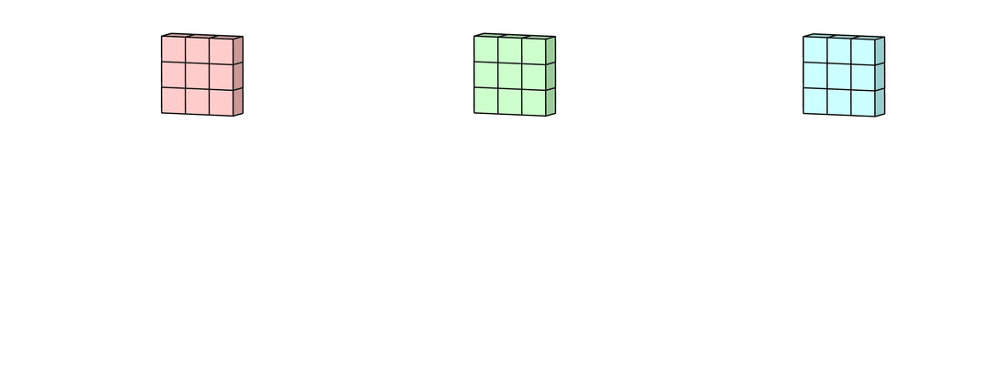
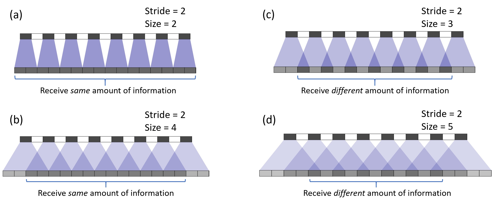
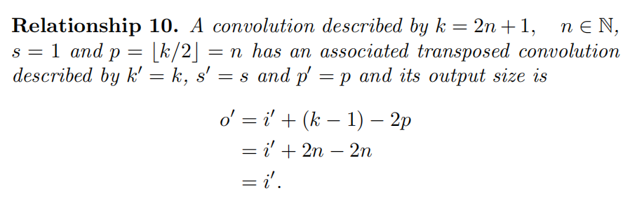
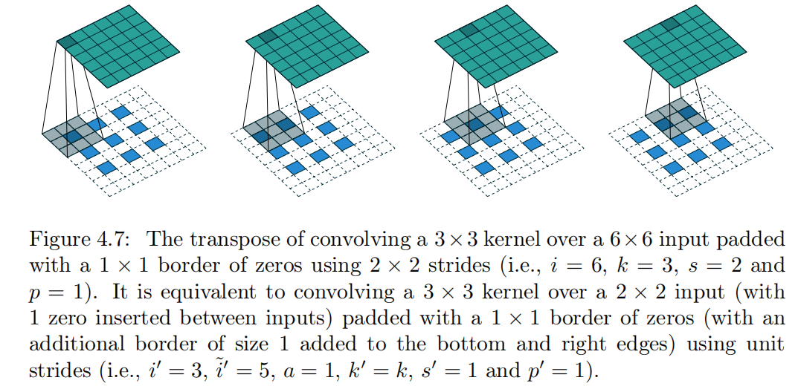

# 目录
## [1. 卷积类型总结](#jump1)　
## [2. 卷积运算](#jump2)　

# 卷积类型总结
## 1. 普通2D卷积

过程：
对于每个filter拥有和输入层同样深度的kernel个数，每个kernel与对应的输入通道进行如下卷积过程
　
生成多个卷积后的2d输出，然后相加合并成一个输出,**并加上对应的bias**,作为一个输出通道

网络中每个卷积层有多个filter,从而输出不同的深度，即不同的输出通道

- 卷积后大小计算公式　　
$$ o=lower\_bound(\frac{input+2padding-kernel}{stride})+1$$  

- 权值共享(Parameter Sharing)
每一个kernel处理整张对应的channel，大大减少了参数的个数
－　局部感知(Local Connectivity)
就是每个filter(神经元),只对应输入层的部分，即kernel对应的部分

补充：
- 每个filter含有多个kernel, 每个kernel的权重是不一样
- 但是每个filter只用一个bias
- 在filter生成一个求和后的2D channel后，对应的每个点加上bias
## 2. 3D卷积　　

区别：
－　在三个维度上扫描，长、宽、深度
－　$filter\ depth < input\ layer\ depth$
－　输出为3d
应用：
3D segmentations/ point cloud　　

## 3 1X1卷积

卷积核大小为$1\times 1$, 每个filter卷积后图像大小不变。经过该卷积层，只有depth变化。
作用：
- 改变维度（升、降）
即使降低维度，也有可能包含了必要的信息
- 增加非线性
可以在保持feature map尺度不变的（即不损失分辨率）的前提下大幅增加非线性特性（利用后接的非线性激活函数），把网络做的很deep
- 跨通道信息交互
使用1x1卷积核，实现降维和升维的操作其实就是channel间信息的线性组合变化，3x3ｘ64 channels的卷积核后面添加一个1x1x28 channels的卷积核，就变成了3x3x28channels的卷积核，原来的64个channels就可以理解为跨通道线性组合变成了28channels，这就是通道间的信息交互  

应用：
Network in Network /Inception /ResNet

## 4. 转置卷积Transposed Convolution (Deconvolution)
目的：
通过卷积，上采样图片

更多动画和内容，参考[这里](https://github.com/vdumoulin/conv_arithmetic)  

卷积操作可以用矩阵乘法实现

上采样同样可通过矩阵相乘实现，此时卷积矩阵为之前卷积的转置矩阵

具体转置卷积过程以及计算参考[这里](https://arxiv.org/abs/1603.07285)

#### 4.1棋盘效应　Checkerboard artifacts

在使用网络生成上采样时，生成的图片上有棋盘图案。
造成原因：
- 来自不均衡的转置卷积操作，　当卷积大小不能被步长整除时，使得某些区域得到更多的‘喷涂’。
deconvolution can easily have “uneven overlap,” putting more of the metaphorical paint in some places than others.
- 网络有可能自己学习出不均衡的转置卷积，也有可能学习出好的卷积

解决方法：
- 最后一层使用步长为１的转置卷积
- 使用stride可以整除kernel大小的组合
- 调整图像大小（使用最近邻插值或双线性插值），然后执行卷积操作  

更多内容参考[这里](https://distill.pub/2016/deconv-checkerboard/)

## 5.空洞卷积(Dilated Convolution)

是在标准的 convolution map 里注入空洞，以此来增加 reception field。相比原来的正常convolution，dilated convolution 多了一个 hyper-parameter 称之为 dilation rate 指的是kernel的间隔数量(e.g. 正常的 convolution 是 dilatation rate 1)。
 

目的：
在不增加kernel大小的情况下，增加感受域　　

## 6. Separable Convolutions
### 6.1 Spatially Separable Convolutions
利用将2D卷积核拆分为两个１Ｄ的卷积核，按顺序进行卷积，得到同等大小的输出。　　

一般卷积中，是3 x 3 kernel直接和图像卷积。而Spatially Separable Convolution中，首先是3 x 1的卷积核和图像卷积， 然后再是1 x 3卷积核操作。这样一来，只需要6个参数就可以搞定了，而相同的一般卷积操作需要9个参数。

优点：
- 减少计算量，特别是当图片大小远大于kernel　size时  

缺点:
- 不是所有的kernel可以分成两个
- 如果我们将所有传统卷积用Spatially Separable Convolution替代，那么这将限制在训练过程中找到所有可能的kernels。找到的结果也许就不是最优的  

### 6.2 Depthwise  Separable Convolution  
整体分两步：
depthwise convolutions
使用与输入层深度相同个数的，深度为１的filters,所以输出的深度不变
 
1x1 convolutions

整体：

优点：
- 减少计算量

缺点：
- 网络参数减少，如果是一个较小的模型，那么模型泛化能力将显著减小。这造成的结果就是，模型得到的结果并不是最优

## 7 Flatten Convolution
这种卷积的就是用filter分离的思想，即将标准的filter 拆分为 **3 个1D filter**，而不是直接应用一个标准的卷积filter来将输入层映射为输出层。这个思路类似于前部分所提到的空间可分离卷积，其中的一个2D的空间filter近似于两个rank-1 1D的filter。

优点：
- 减少计算量

缺点：
- 网络参数减少
- 前提条件：filter是rank-1，才被拆分为 3 个 1D 过滤器的交叉乘积。但往往现实应用中的rank高于１。正如论文中所指出的：「随着分类问题的难度增加，解决该问题还需要更多的关键部分… 深度网络中学习过滤器具有分布的特征值，并且将分离直接用于过滤器会导致明显的信息丢失。」

## 8. 分组卷积 Grouped Convolution
在分组卷积中，滤波器被分成不同的组。每组负责具有一定深度的传统二维卷积。下面的例子可以更清楚地说明这一点。

上面是两个滤波器组分组卷积的图示。在每个滤波器组中，每个滤波器的深度仅为名义二维卷积的一半。深度为DIN/2。每个过滤器组包含DOUT/2过滤器。第一滤波器组（红色）与输入层的前半部分（[：，：，0:din/2]）卷积，而第二滤波器组（蓝色）与输入层的后半部分（[：，：，din/2:din]）卷积。因此，每个过滤器组创建DOUT/2通道。总的来说，两个组创建2个dout/2=dout通道。然后我们将这些通道与dout通道叠加在输出层中。

#### 8.1 分组卷积 VS 深度卷积
如果过滤器组的数量与输入层的通道数相同，每个过滤器的深度就是 Din / Din = 1，其与深度卷积中的过滤器深度相同

优点：
- 训练的高效性。由于卷积被拆分到几条路线中，每条路线都由不同的 GPU 分别进行处理。这一过程就允许模型以平行的方式在多个 GPU 上进行训练
- 模型更加高效，减少参数。例如，当过滤器组数增加时，模型参数就会减少。在前一个案例中，在标准的 2D 卷积中，过滤器有 h x w x Din x Dout 个参数，而在拆分为 2 个过滤器组的分组卷积中，过滤器仅有 (h x w x Din/2 x Dout/2) x 2 个参数：参数数量减少了一半。
- 可以看成是structured sparse，每个卷积核的尺寸由C∗K∗K变为$\frac{C}{G}∗K∗K$，可以将其余$(C−\frac{C}{G})∗K∗K$的参数视为0，有时甚至可以在减少参数量的同时获得更好的效果（相当于正则）。

缺点：
- 每个filter组仅对从前面层的固定部分向后传递的信息进行处理,阻碍了训练期间信息在通道组之间流动

## 9. 混洗分组卷积 Shuffled Grouped Convolution
应用于ShuffleNet
总的来说，混洗分组卷积包括分组卷积和通道混洗（channel shuffling）
我们了解了卷积核filters被拆分为不同的组，每个组都拥有一定深度的 2D卷积的负责一定深度的特征提取的工作，这样显著减少了整个操作的步骤。

通道混洗的思路就是混合来自不同filter组的信息。下图中，显示了应用有 3 个filter组的第一个分组卷积 GConv1 后所得到的特征图map。在将这些特征maps输入到第二个分组卷积之前，先将每个组中的通道拆分为几个小组，然后再混合这些小组.

经过这种混洗分组后，我们再接着执行第二个分组卷积 GConv2。但是现在，由于混洗层中的信息已经混合，我们实质上是为GConv2中的每个组提供了特征映射层（或输入层）中的不同组。因此，不仅信息可以在通道组间进行流动，特征表示也得到增强.

## 10. 逐点分组卷积 Pointwise grouped convolution
shuffleNet论文认为，1 x 1卷积的计算成本也很高。它建议将组卷积用1 x 1大小的卷积。正如名称所示，逐点分组卷积执行1 x 1卷积的组操作。该操作与分组卷积相同，只有一个修改 - 是在1x1而不是NxN(N>1)大小的filter上执行。

在ShuffleNet论文中，作者使用了我们学到的三种类型的卷积：（1）混洗分组卷积; （2）逐点分组卷积; （3）深度可分离卷积。这种架构设计显着降低了计算成本，同时保持了准确性。

# 卷积运算
## 1. convolution
$i:input\ size$
$k: kernel\ size$
$s: stride $
$o: output \ size$
$p: padding \ size$
$$o=\lfloor \frac{i+2p-k}{s}\rfloor +1$$
half padding: 输入输出大小不变
$$p=\lfloor \frac{k}{2}; \rfloor \ s=1; \ k \ is \ odd$$

## 2. tanspose convolution
一种看法：transpose conv可以表示为其输入为某个convolution的输出。
2.1 no padding, unit stride

2.2 zero padding, unit stride

2.3 half padding, unit stride

总结：
$$o'=i'+(k-1)-2p$$
2.4 no padding, no unit stride
**逆向来看，stride>1,所以deconvolution的stride<1，这也是为什么叫fractionally strided convolution**

2.5 zero padding， non unit stride

新增a，来解除上述的限制

## 3. dilated convolution
d: dilated rate
kernel size:$\hat{k}=k+(k-1)(d-1)$
计算方法同之前相同，k替换为$\hat{k}$
$$o=\lfloor \frac{i+2p-k-(k-1)(d-1)}{s}\rfloor +1$$