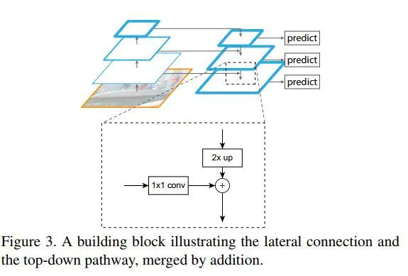
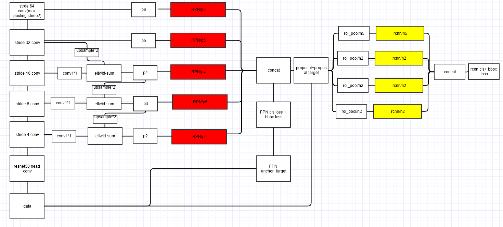

# Feature Pyramid Networks

## 网络结构
#### 1. Bottom up
作者使用resnet作为backbone。将输出相同尺寸的feature map层称为一个**stage**，对于resnet，作者选取每个stage的最后一个residual block的激活输出作为预测map；一共有四个，对应stride{4,8,16,32}相对于原图，不使用stride=2的feature map原因是太大了。
#### 2. Top down 
这里上采样使用了**最邻近点插值**；bottom up输出的feature map经过1x1卷积进行深度通道改变（减少），已匹配上采样的通道数。  
融合后的feature经过3x3卷积，防止混叠，同时固定所有的融合feature的深度为一样的值=256

## 结合应用
#### 1.RPN
* 如下图，分别生成了5个feature map，每个map有对应不同的anchor设置，分别为
    - 面积{$32^2, 64^2，128^2， 256^2，512^2$}（在原图大小下的）
    - 比例{0.5,1，2}
同样的浅层的feature，使用的size越小，为了检测小的物体 

* GT的判断方法同faster-rcnn

* 所有的feature都共享一套之后的处理参数，即3x3卷积+两个平行1x1卷积（分类+定位）；作者尝试使用不同的head，提升不明显
#### 2.Fast-Rcnn

