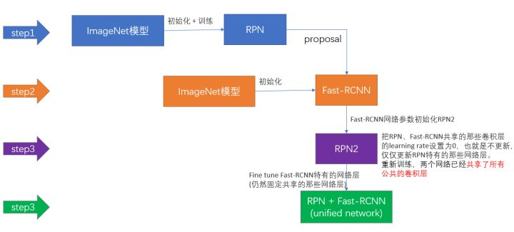

## 1. RCNN: region with cnn features  
### 网络结构  

CNN提取出来的特征图(maxpooling之后)进入BBox回归器
FC的输出进入SVM进行分类
### 流程
1. 区域推荐(region proposal) ->> proposals  
输入图片，使用selective search的方法，生成~2K 个region proposal   

2. cnn特征提取 ->> 4096 feature vector
   对每一个proposal使用cnn（paper使用Alexne）网络进行特征提取   
   **由于全连接层的原因，cnn网络输入为固定值，大小为227*227。每个proposal大小不一样，作者先padding 16个像素，然后进行缩放**。  
3. SVM分类  
   对于n个类别的问题，训练n+1个SVM(前景+背景)。然后对上一步提取的特征进行分类。  
4. NMS 非极大值抑制  
   对每个类别的框，进行nms操作  
5. Bbox 回归  

### 训练
- cnn网络预训练：在标准的大型数据集上训练cnn  
- 特定领域的参数调优（cnn fine tunning)：    
    将原先cnn网络的fc层替换掉，因为类别由1000变成21；
    使用region proposal的样本进行训练。定义**IOU>0.5**的为正样本，否则就是负样本
    mini-batch: 32正，96负  
- 训练svm： 
  正样本为ground-truth; 
  负样本为没有该类别的，以及**IOU<0.3**的候选框。0.3是经过网格搜索得到的。
  训练使用hard negative mining method。*难负例挖掘算法，用途就是正负例数量不均衡，而负例分散代表性又不够的问题，hard negative就是每次把那些顽固的棘手的错误,再送回去继续练,练到你的成绩不再提升为止*
- 训练Bbox回归

补充：
1. 使用不同的IOU阀值判断负样本的原因。CNN对小样本容易过拟合，所以需大量样本；SVM对适合小样本训练，所以严格限制IOU，减少样本个数
2. 为甚不用cnn直接分类，而使用额外SVM： 由于CNN负样本IOU<0.5,网络定位精度差。 

### 缺点
1. 推理速度慢。来自于selective search，以及多次cnn卷积操作
2. 训练慢。分三步训练
3. 候选框的强行放缩，影响精度

## 边框回归
### 定义
框表达形式 = （x, y, w, h)
边框回归目的：给定预测框$(P_x, P_y, P_w, P_h)$,真实框$(G_x, G_y, G_w, G_h)$  
$$f(P_x, P_y, P_w, P_h) \approx (G_x, G_y, G_w, G_h)$$
### 方法
思路：平移+尺度缩放
- 平移：$\Delta x = P_wd_x(P)$  这里平移不是差值，而是转换为预测框边长的百分比。由于cnn网络具有尺度不变性，对于同样的候选框，在不同尺度下，cnn提取的特征是一样，如果使用差值计算位置，则这种情况下，位移结果不同。$\Delta y$同理。  

$$G_x = P_wd_x(P)+P_x$$  

$$G_y = P_hd_y(P)+P_y$$   

- 缩放：$S_w = \exp{d_w(P)}$ 这里使用对数操作。 
    
$$G_w = P_w\exp (d_w(P))=P_wS_w$$  

$$G_h = P_h\exp (d_h(P))=P_hS_h$$
所以边框回归学习是：$d_x(P), d_y(P), S_w, S_h$  
### 训练
- 训练时输入
  CNN提取出来的特征，在RCNN中对应的是最后pooling层出来的特征$\phi(P)$  
  ground-truth $t_* = (t_x, t_y, t_w, t_h)$（由下面公式算出)  
  $$t_x = (G_x - P_x)/P_w$$ $$t_y = (G_y - P_y)/P_h$$  
  $$t_w = log(G_w/P_w)$$  $$t_h = log(G_h/P_h)$$
- 输出:对应的4个值
- 目标函数  

$$Loss = \sum_i^N (t_i^* - w^T\phi(P^i))^2 + \lambda ||w||^2$$  

- 同SVM一样，Bbox回归器个数与类别个数相同
### 其他
使用**IOU>0.6**的框才进行回归，因为只有IOU较大才满足线性变换，才可以用线性回归。
   

## 2. SPP-Net: Spatial Pyramid Pooling net  

### 网络结构  
基本同rcnn，只是将rcnn中最后一层的maxpooling替换为ssp  

### SSP
  

一种池化层，能输出固定维度的向量，从而使cnn网络的输入图像尺寸不受限制。  
- 大体操作：以图中的ssp配置为例  
输入为 长X宽X通道数（W* H *B）的特征图，对于每个通道的图片，生成三张图片，每个图片等分为16，4，1个block，对每个block进行maxpooling操作，接着拼接起来，最终生成固定大小的输出 （16+4+1）X B  
- 具体操作：
对图片进行不同等分的操作，其实就是pooling，只需要计算好对应的kernel size和stride size。
假设需要需要将图片等分为 $l*l$

$$ksize = ceil(input\ size/l+1)$$  

$$stride = floor(input\ size/l+1)$$

### 候选区域到feature map的映射做法详解
思路：知道网络卷积和池化层的配置参数，可以知道原图与特征图的放缩比例S。  
SPP-net 是把原始ROI的左上角和右下角 映射到 feature map上的两个对应点。

论文中的最后做法：把原始图片中的ROI映射为 feature map中的映射区域（上图橙色区域）  
1. 每层padding
$$padding=⌊ksize/2⌋$$  

$$S = \prod_0^i stride_i$$  

2. 左上角取： 

$$x'=⌊x/S⌋+1$$  

$$y'=⌊y/S⌋+1$$  

3. 右下角取：   

$$x'=⌈x/S⌉−1$$  
 
$$y'=⌈y/S⌉−1$$  

具体详细过程参考[这里](https://blog.csdn.net/forever__1234/article/details/79910175)

### 训练
- 调优CNN：是训练全连接层。 IOU>0.5为正，IOU<0.5为负
补充：
    - 图像需要预先rescale到min(w,h)=s,即最小边长为s（论文中为256），然后再进入网络
- 训练SVM：IOU设置同RCNN，ground-truth为正，IOU<0.3为负
- 训练Bbox回归：IOU>0.5为训练样本

### 优缺点
#### 优点
1. 速度比rcnn快。只对原图进行一次cnn特征提取。相对于RCNN对每个region proposals都做CNN，SPPNET只对原图做一次cnn，之后再根据region proposal的位置推算出在特征图上对应的窗口。**(原图image和特征图是相互对应的)**
2. SSP的原因，是模型对形变具有鲁棒性，scale-invariance。
#### 缺点
1. 仍需要使用selective search进行候选框搜索
2. 多步骤训练，同RCNN
3. 微调算法不能更新在空间金字塔池之前的卷积层。限制了深层网络的精度. 根本原因是当每个训练样本（即RoI）**来自不同的图像**时，通过SPP层的反向传播是非常低效的，这正是训练R-CNN和SPPnet网络的方法。低效的部分是因为每个RoI可能具有非常大的感受野，通常跨越整个输入图像。由于正向传播必须处理整个感受野，训练输入很大（通常是整个图像).

## 3. Fast-RCNN  
  
### 整体结构  

- 接收整副图像和一系列的proposal作为输入
- 卷积神经网络以及最大值池化层等对图片进行特征提取
- 对每一个proposal,找到对应的特征图窗口
- 使用Region of Interest (ROI)生成固定长度的特征向量
- fc层
- 最后接上两个损失层
    - 一个输出K个类别加上1个背景类别的Softmax概率估计（不再使用SVM）
    - 另一个为K个类别的每一个类别Bbox 回归

### RoI Pooling
- RoI层只是空间金字塔池层(SSP)的特殊情况，其只有**一个金字塔层**。将region proposal划分为 H×W 大小的网格
- 输出层的大小(H W)是超参数，需要提前设定
- 计算池化子窗口方法也同SSP

### 训练
#### 调优
1. 修改预训练好的网络的结构（RoI, softmax, regresion）
2. 输入为固定大小的图片和对应的proposal，IOU>0.5正样本
3. 为了避免这个[原因](#tag1)。SGD的mini-batch是**分层次的采样**，假设一共寻要R个proposal，那么我们首先采样N张图片，然后再每张图片采样R/N个proposal，这些proposal的feature就只需要计算一次，在前向和后向传播过程中共享计算和内存。
4. 网络全连接层后面的两个网络进行了联合优化，也就是将sotfmax分类器和边界框回归网络进行联合优化，而不是分开来优化。
5. 改进全连接层。由于卷积层计算针对的是一整张图片，而全连接层需要对每一个region proposal都作用一次，所以全连接层的计算占网络计算的将近一半。作者采用SVD来简化全连接层计算
#### 损失函数
多损失融合（分类损失和回归损失融合），分类采用log loss（即对预测中真实分类对应的概率取负log，分类输出K+1维），回归的loss和R-CNN基本一样。每一个用于训练的Roi都有一个真实的类标记u和一个确切可靠的边界回归框v，我们使用多任务损失L来对分类和边界框进行联合优化训练. u=1,为正样本，u=0负样本

总的损失函数如下： 

$$L(p,u,t^u,v)=L_{cls}(p,u)+\lambda [u\geq 1]L_{loc}(t^u-v)$$   
括号指示函数,当u>=1时，[u>=1]=1,否则为零，因为背景不没有回归框损失

$$L_{cls}(p,u)=-logp_u$$  

$$L_{loc}(t^u-v)= \sum_{i\in(x,y,w,h)}smooth_{L1}(t_i^u-v_i) $$  

$$smooth_{L1}(x)
\begin{cases}
    0.5x^2, &if\ |x|<1\\
    |x|-0.5 &otherwise
\end{cases}$$  
由于在实际过程中，回归和分类loss的量级差距过大，用参数λ平衡二者使总的网络Loss计算过程中能够均匀考虑2种Loss  

#### RoI Pooling反向传播
池化层记录每个block激活的值对应的index，反向传播时根据index求导  

#### Truncated SVD for faster detection(截断奇异值分解)
原因：对于整副图像的分类，用在计算全连接层的时间和卷积层相比是很小的，但是，如果对于ROi的数量检测和处理来说，全连接层几乎又占据了整个前向传播接近一半的时间  

利用下述公式：$W\approx U\sum_tV^T$ (SVD) ,可以将计算的复杂度从$u×v$变成$t(u+v)$,如果此时t的值会远远小于min(u,v)的最小值的话，那么这时候用这种奇异值分解的办法便可以特别好的简化计算过程，节省很多的前向计算的时间！

具体做法：
对应于W的单个全连接层由两个全连接层替代，在它们之间没有非线性激活层。这些层中的第一层使用权重矩阵$\sum_tV^T$（没有偏置），并且第二层使用$U$（其中原始偏差与W相关联）  

### 总结
- 用softmax代替SVM分类器，更加简单高效
- Fast-rcnn训练时单级的，即可以直接训练整个网络（包括分类和回归部分）
- 使用了多级任务损失
- 训练可以更新所有网络层参数
- 加快了训练速度  

不足
- 仍然采用selective search，整个检测流程时间大多消耗在这上面 

## 4. Faster-RCNN  

### 4.1 Region Proposal Networks
RPN网络用于生成region proposals。该层通过softmax判断anchors属于positive或者negative（二分类），再利用bounding box regression修正anchors获得粗定位的proposals。替换掉了传统的proposlas方法。

RPN网络实际分为2条线，上面一条通过softmax分类anchors获得positive和negative分类，下面一条用于计算对于anchors的bounding box regression偏移量，以获得精确的proposal。而最后的Proposal层则负责综合positive anchors和对应bounding box regression偏移量获取proposals，同时剔除太小和超出边界的proposals

### 4.2 anchors
一组事先定义好的矩形。有三种大小，三种比例，一共**9**中类型。引入了检测中常用到的多尺度方法。

具体的anchors size其实是根据检测图像设置的。在paper中，首先会把任意大小的输入图像reshape成800x600。因此anchors中长宽1:2中最大为352x704，长宽2:1中最大736x384，基本是cover了800x600的各个尺度和形状。
  

在backbone网络输出的feature maps上，为每一个点都配备这9种anchors作为初始的检测框。
- 假设在conv5 feature map中每个点上有k个anchor（默认k=9），而每个anhcor要分positive和negative，所以每个点由256d feature转化为cls=2k scores；而每个anchor都有(x, y, w, h)对应4个偏移量，所以reg=4k coordinates
- 全部anchors拿去训练太多了，训练程序会在合适的anchors中随机选取128个postive anchors+128个negative anchors进行训练

训练loss方程不变，区别是类别只有两个

### 4.3 Proposal Layer
Proposal Layer按照以下顺序依次处理：
- 生成anchors，利用对所有的anchors做bbox regression回归（这里的anchors生成和训练时完全一致）
- 按照输入的positive softmax scores由大到小排序anchors，提取前pre_nms_topN(e.g. 6000)个anchors，即提取修正位置后的positive anchors
- 限定超出图像边界的positive anchors为图像边界，防止后续roi pooling时proposal超出图像边界
- 剔除尺寸非常小的positive anchors
- 对剩余的positive anchors进行NMS（nonmaximum suppression）
- Proposal Layer有3个输入：分类器结果，对应的回归结果，卷积放缩比例（用于映射回原图）
- 输出proposal=[x1, y1, x2, y2]，注意，由于在第三步中将anchors**映射回原图**判断是否超出边界，所以这里输出的proposal是对应MxN输入图像尺度的，这点在后续网络中有用。

### 4.4 训练
Faster R-CNN的训练，是在已经训练好的model的基础上继续进行训练。实际中训练过程分为6个步骤：
1. 在已经训练好的model上，训练RPN网络
2. 利用步骤1中训练好的RPN网络
3. 第一次训练Fast RCNN网络
4. 第二训练RPN网络
5. 再次利用步骤4中训练好的RPN网络，收集proposals
6. 第二次训练Fast RCNN网络
训练过程类似于一种“迭代”的过程，只循环了2次。原因是循环更多次没
