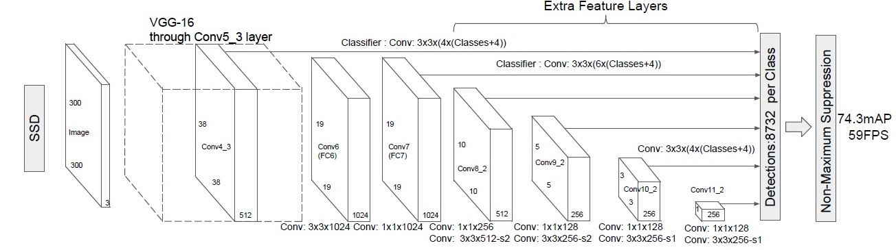
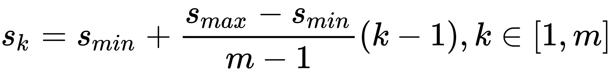
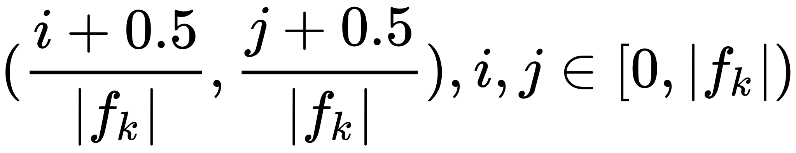
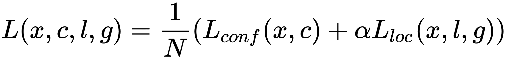
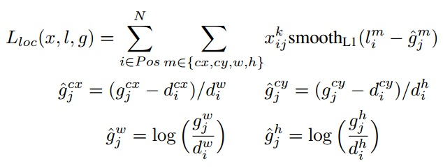
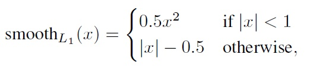
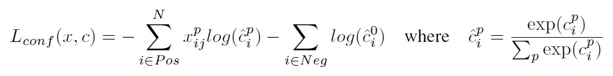

# Single Shot MultiBox Detector
# 网络架构
SSD采用VGG16作为基础模型，然后在VGG16的基础上新增了卷积层来获得更多的特征图以用于检测。
- 输入图片大小： 300x300 512x512
- 分别将VGG16的全连接层fc6和fc7转换成 3x3 卷积层conv6和1x1卷积层conv7，同时将池化层pool5由原来的stride=2的2x2变成stride=1的3x3.
- 移除dropout层和fc8层，并新增一系列卷积层
- conv6使用dilation conv
```
net = max_pool2d(net, 3, stride=1, scope="pool5")
# additional SSD layers
# block 6: use dilate conv
net = conv2d(net, 1024, 3, dilation_rate=6, scope="conv6")
# block 7
net = conv2d(net, 1024, 1, scope="conv7")
```
- Conv4_3层将作为用于检测的第一个特征图。conv4_3层特征图大小是38x38，但是该层比较靠前，其norm（gradient magnitude）较大，如果混在一起训练，在实践过程中会很难训练，所以在其后面增加了一个L2 Normalization层(其仅仅是对每个像素点在channle维度做归一化,归一化后一般设置一个可训练的放缩变量gamma)
```
# l2norm (not bacth norm, spatial normalization)
def l2norm(x, scale, trainable=True, scope="L2Normalization"):
    n_channels = x.get_shape().as_list()[-1]
    l2_norm = tf.nn.l2_normalize(x, [3], epsilon=1e-12)
    with tf.variable_scope(scope):
        gamma = tf.get_variable("gamma", shape=[n_channels, ], dtype=tf.float32,
                                initializer=tf.constant_initializer(scale),
                                trainable=trainable)
        return l2_norm * gamma
```


- 在网络的不同深度，提取出来不同尺度下的feature map

- 在feature map上使用不同的anchor，分别进行并行的两个3x3卷积（same padding），分别生成框回归信息和分类信息
- 令n为该特征图所采用的先验框数目，那么类别置信度需要的卷积核数量为nxc ，而边界框位置需要的卷积核数量为nx4

## 先验框设置
- 编码设置同R-CNN
- 网络输出6中feature maps，每个map对应不同数量的anchor；在map中，anchor的尺寸和比例
- 尺度，遵守一个线性递增规则：随着特征图大小降低，先验框尺度线性增加：

k代表层数，1-5（第一层conv3是单独设置的）；s表示anchor相对于输入原始图片的比例，smin=0.2，smax=0.9；对于第一个特征图，其先验框的尺度比例一般设置为$s_{min}/2=0.1$
- 比例：$a_r \in {1,2,3,1/2,1/3,1^*}$;具体计算方法：（s为具体尺寸）
$$w=s\sqrt{a_r}  h=s/\sqrt{a_r}$$
每个特征图都设置了两个长宽比为1但大小不同的正方形先验框（1,1*）：
对于1*：$s_k=\sqrt{s_ks_{k+1}}$.注意最后一个特征图需要参考一个虚拟$s_{m+1}=300*105/100=315$
- 但是在实现时，Conv4_3，Conv10_2和Conv11_2层仅使用4个先验框，它们不使用长宽比为3,1/3的先验框
- 每个单元的先验框的中心点分布在各个单元的中心

$f_k=特征图大小$
- 所以SSD300一共可以预测$38*38*4+19*19*6+10*10*6+5*5*6+3*3*4+1*1*4-8732$个边界框，这是一个相当庞大的数字，所以说SSD本质上是密集采样。  

## 训练
### 输入
固定大小
- 321*321
- 513*513
### 1.anchor匹配
- 对于图片中每个ground truth，找到与其IOU最大的先验框，该先验框与其匹配
- 对于剩余的未匹配先验框，若某个ground truth的IOU大于某个阈值（一般是0.5），那么该先验框也与这个ground truth进行匹配
- 为了保证正负样本尽量平衡，采用了hard negative mining，就是对负样本进行抽样，抽样时按照置信度误差（预测背景的置信度越小，误差越大）进行降序排列，选取误差的较大的top-k作为训练的负样本，以保证正负样本比例接近1:3。
### 2. Loss




权重系数 [公式] 通过交叉验证设置为1。$x_{ij}^k \in {1,0}$为一个指示参数，当$x_{ij}^k=1$时表示第i个先验框与第j个ground truth匹配，并且ground truth的类别为p. c为类别置信度预测值,其中第一个代表背景的概率。
### 3.数据增强
- 使用原图
- 采样图片小块(patch),使其与目标的IOU为0.1,0.3，0.5，0.7，0。9
- 随机采集块域（Randomly sample a patch）
patch的大小为原图的[0.1,1].比例[0.5,2].最终所有的patch大小resize到输入的固定尺寸。水平翻转（horizontal flip），随机裁剪加颜色扭曲（random crop & color distortion）

## 预测
- 每个预测框，首先根据类别置信度确定其类别（置信度最大者）
- 过滤掉属于背景的预测框
- 根据置信度阈值（如0.5）过滤掉阈值较低的预测框
- 对于留下的预测框进行解码，根据先验框得到其真实的位置参数（解码后一般还需要做clip，防止预测框位置超出图片）。解码之后，一般需要根据置信度进行降序排列，然后仅保留top-k（如400）个预测框。
- NMS

## 缺点
对于小的物体，性能不是很好（因为浅层feature map的表征能力不够强）；可以通过增大输入图片改善，但速度降低了
## reference
[paper](https://arxiv.org/pdf/1512.02325.pdf)
[知乎](https://zhuanlan.zhihu.com/p/33544892)