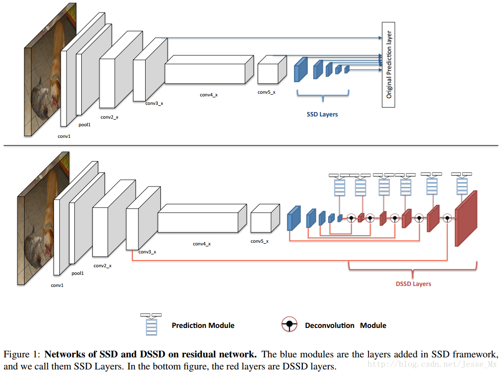
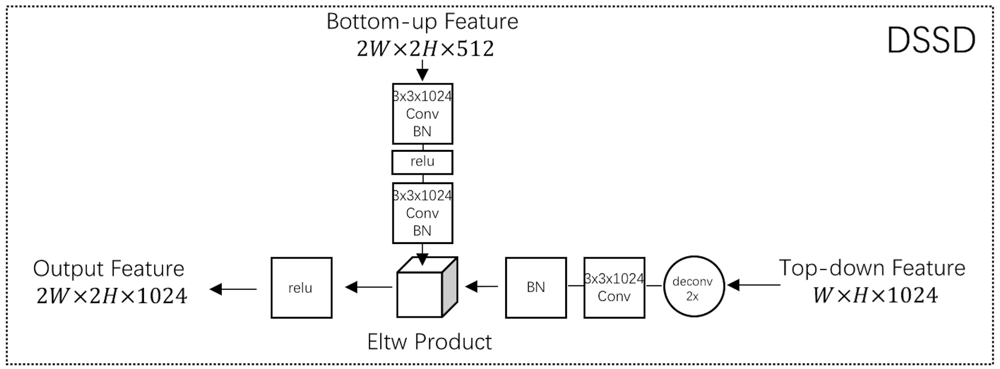

# Deconvolutional Single Shot Detector (DSSD)
- 主要提升了小目标的检测性能
- 但牺牲了速度，主要原因在于引入的Resnet-101太深；其次由于增加了网络层数；用了更多的anchor
## 网络结构
DSSD将SSD的VGG网络用Resnet-101进行了替换，在分类回归之前引入了残差模块，在SSD添加的辅助卷积层后又添加了反卷积层形成“宽 - 窄 - 宽”的“沙漏”结构。

#### prediction module
原文使用了第三种方式，其效果最好

#### Deconvolutional Module
作者参考 hourglass module，其为对称的encoder+decoder形式。然而这里decoder层数较少与encoder，原因有二：
1. 检测算法速度优先
2. 没有对应的与训练网络，从头训练太难

- **浅层特征图的通道数需要变成和深层图片相同**，在反卷积模型中，所有卷积和反卷积操作，卷积个数都依赖于输入的深层特征图的通道数
- 这里采用了element-wise product
- 在DSSD进行高低层特征融合时，浅层特征必要的时候需要增L2 normalization处理（浅层特征图gradient magnitude太大）

## 训练
基本上同SSD一样，有以下一些改动：
- anchor的比例使用K-means，最终k=7,增加了比例1.6；同时，对于所有的prediction，使用了所有的比例anchor
- 训练分为两个阶段，先冻结DSSD网络中SSD网络层的参数，只用预训练好的SSD模型去微调DSSD层的权重（DSSD层的权重的初始化方式为Xavier）；第二阶段解冻第一阶段的所有层参数，放开了微调。
## 推理
由于有BN层，为了提升速度，讲BN整合到了Conv层，提升1.5-2倍速度

## reference
[paper](https://arxiv.org/pdf/1701.06659.pdf)
[文章](https://blog.csdn.net/zj15939317693/article/details/80599596)