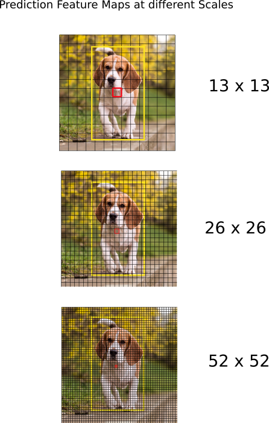

# Yolo-v3
## 网络架构

## anchor box
1. 使用ｋｎｎ确定

## 训练输入
1.　多尺度训练
由于网络全由**卷基层**组成，理论上图片大小不受限制：
每隔固定代数，改变输入训练输入图片的大小，其大小是３２的倍数(网络结构设计的关系，最终feature map是原图的３２分之一)
2. 最终的feature　map尺寸是奇数，物体中心落在grid中

## 网络输出
在feature map上，每个grid都预测Ｂ个框（论文只是三个）

网络结构中，为了检测各种大小的物体，其输出了三种不同尺寸的feature map

## 框回归
