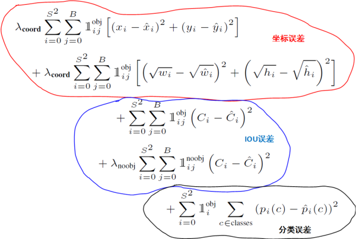

# Yolo-v3

## 网络架构
1. 分类架构
名称：darknet-53
其中含有Shortcut connections，同resnet，相同channel size，进行对应add操作
  

2. 识别架构
 

- upsample：x2 线性插值
- feature map是进行concatenation
- 一共输出三种scale下的feature map,用来识别不同大小的物体
- downsampling也是通过卷积层实现，stride=2
- 最后feature通过1x1卷积 depth=(B*(5+C))


## anchor box
1. 在训练集上，使用k-means确定框的size,使用如下距离度量，排除size的干扰
$$D(box,centroid)=1-IOU(box,centroid)$$
2. 9个anchor，分别在每个scale上使用3个；最大的三个anchor用在第一个feature map(有最大的感受野,stride=32，框的size也要进行放缩),一次类推

## 训练输入
1.　多尺度训练
由于网络全由**卷基层**组成，理论上图片大小不受限制：
每隔固定代数，改变输入训练输入图片的大小，其大小是３２的倍数(网络结构设计的关系，最终feature map是原图的３２分之一)
2. 最终的feature　map尺寸是奇数，物体中心落在grid中
3. 训练时，最好还是固定size，由于训练是一组batch，如果batch中的图片大小不一样，则在进行concatenation的时候出错
4. resize的方法：保留原始图片的比例，其余地方padding灰色


## 网络输出
1. 在feature map上，每个grid都预测Ｂ个框（论文只是三个）

2. 去掉不含物体的框，object confidence < threshod
3. 使用NMS
4. 对于含有物体的框，我们只考虑class probability最大的值

## loss设计
1. v1的loss

与v3的区别：每个格子输出B个box，以及每个类的概率(softmax);不在是每个box都有所有的概率；
$1^{obj}_{ij}$表示物体落入格子i的第j个bbox内.如果某个单元格中没有目标,则不对分类误差进行反向传播;B个bbox中与GT具有最高IoU的一个进行坐标误差的反向传播,其余不进行.
考虑每种loss的贡献率,YOLO给coordErr设置权重λcoord=5.在计算IOU误差时，包含物体的格子与不包含物体的格子，二者的IOU误差对网络loss的贡献值是不同的。若采用相同的权值，那么不包含物体的格子的confidence值近似为0，变相放大了包含物体的格子的confidence误差在计算网络参数梯度时的影响。为解决这个问题，YOLO 使用λnoobj=0.5修正iouErr。对于相等的误差值，大物体误差对检测的影响应小于小物体误差对检测的影响。这是因为，相同的位置偏差占大物体的比例远小于同等偏差占小物体的比例。YOLO将物体大小的信息项（w和h）进行求平方根来改进这个问题，但并不能完全解决这个问题。

2. v3的loss
框的输出和object confidence如下

 
```python
loss_x = self.mse_loss(x[obj_mask], tx[obj_mask])
loss_y = self.mse_loss(y[obj_mask], ty[obj_mask])
loss_w = self.mse_loss(w[obj_mask], tw[obj_mask])
loss_h = self.mse_loss(h[obj_mask], th[obj_mask])
loss_conf_obj = self.bce_loss(pred_conf[obj_mask], tconf[obj_mask])
loss_conf_noobj = self.bce_loss(pred_conf[noobj_mask], tconf[noobj_mask])
loss_conf = self.obj_scale * loss_conf_obj + self.noobj_scale * loss_conf_noobj
loss_cls = self.bce_loss(pred_cls[obj_mask], tcls[obj_mask])
total_loss = loss_x + loss_y + loss_w + loss_h + loss_conf + loss_cls
```
对于框的x,y,w,h仍使用MSR，对于其他三项，使用了交叉熵；特别的，对于分类，由于每个框都有分类，所以这里也变成了只计算含有目标的box，而不是grid，类别概率也设有阈值。
- 使用sigmoid的原因：v2开始预测多标签，target不再是one-hot形式，softmax不适用。

## 框回归
[看这里](bbox_regression.md)

## reference

[build yolo3 in pytorch](https://blog.paperspace.com/how-to-implement-a-yolo-object-detector-in-pytorch/)
[What’s new in YOLO v3](https://towardsdatascience.com/yolo-v3-object-detection-53fb7d3bfe6b)
[yolo1](https://arxiv.org/pdf/1506.02640.pdf)
[yolo2](https://arxiv.org/pdf/1612.08242.pdf)
[yolo3](https://pjreddie.com/media/files/papers/YOLOv3.pdf)

# yolo-v4

