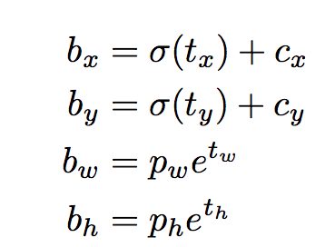
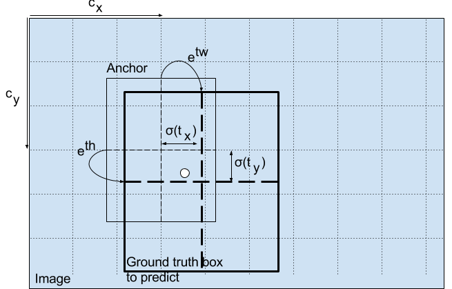

## 边框回归
### 定义
框表达形式 = （x, y, w, h)
边框回归目的：给定预测框$(P_x, P_y, P_w, P_h)$(Anchor),真实框$(G_x, G_y, G_w, G_h)$  
$$f(P_x, P_y, P_w, P_h) \approx (G_x, G_y, G_w, G_h)$$
### 方法　－－RCNN系列
思路：平移+尺度缩放
- 平移：$\Delta x = P_wd_x(P)$  这里平移不是差值，而是转换为预测框边长的百分比。由于cnn网络具有尺度不变性，对于同样的候选框，在不同尺度下，cnn提取的特征是一样，如果使用差值计算位置，则这种情况下，位移结果不同。$\Delta y$同理。  

$$G_x = P_wd_x(P)+P_x$$  

$$G_y = P_hd_y(P)+P_y$$　　
   

- 缩放：$S_w = \exp{d_w(P)}$ 这里使用对数操作。 
    
$$G_w = P_w\exp (d_w(P))=P_wS_w$$  

$$G_h = P_h\exp (d_h(P))=P_hS_h$$
所以边框回归学习是：$d_x(P), d_y(P), S_w, S_h$  

### 训练
- 训练时输入
  CNN提取出来的特征，在RCNN中对应的是最后pooling层出来的特征$\phi(P)$  
  ground-truth $t_* = (t_x, t_y, t_w, t_h)$（由下面公式算出)  
  $$t_x = (G_x - P_x)/P_w$$ $$t_y = (G_y - P_y)/P_h$$  
  $$t_w = log(G_w/P_w)$$  $$t_h = log(G_h/P_h)$$
- 输出:对应的4个值
- 目标函数  
（一开始网络会输出一组x,y,w,h(例如anchor),所以结合Ground True计算整整的回归系数；同事网络也会输出一组4个回归系数；然后可以计算loss）

$$Loss = \sum_i^N (t_i^* - w^T\phi(P^i))^2 + \lambda ||w||^2$$  

- 同SVM一样，Bbox回归器个数与类别个数相同
### 其他
使用**IOU>0.6**的框才进行回归，因为只有IOU较大才满足线性变换，才可以用线性回归。
   

### 方法－－anchor系列/ＹＯＬＯv3　
1. anchor表示：原始图像下的长，宽
2. 物体中心落在一个ｇｒｉｄ上时：
中心点＝对应feature map上的grid的左上角坐标　＋偏移百分比(0-1)
$d_xd_y＝sigmoid()$,输出范围在０－１对应anchor长宽的百分比  
$pw$时anchor的长度（在feature map下的长度）
   
  