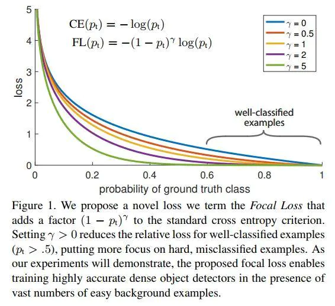
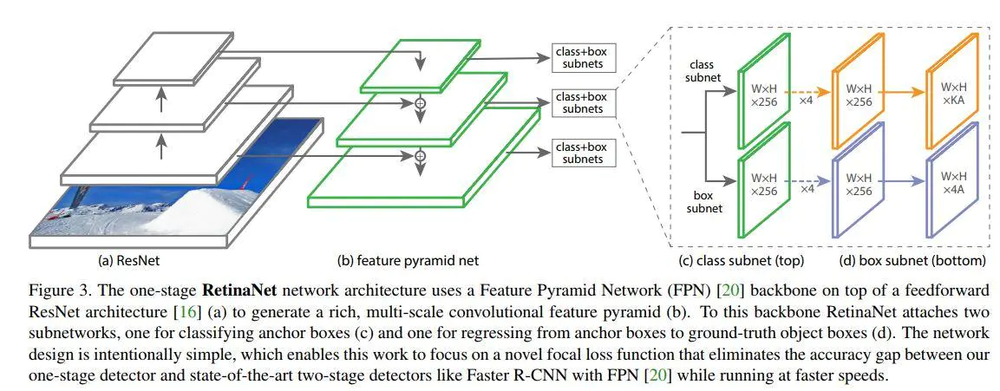

# RetinaNet

## 类别不平衡问题
对于one stage网络，例如ssd,yolo等，其会密集得采样出１0,000甚至100,0000个目标候选区域，然而大部分不含有目标，造成两个问题；
1. 大多negative example不在前景和背景的过渡区域上，分类很明确(这种易分类的negative称为easy negative)，训练时对应的背景类score会很大，换个角度看就是单个example的loss很小，反向计算时梯度小。梯度小造成easy negative example对参数的收敛作用很有限
2. 这些loss可能占据主导位置，让模型退化
但是对于two　stage网络，这些问题被规避了：
1. 会根据前景score的高低过滤出最有可能是前景的example (1K~2K个)，因为依据的是前景概率的高低，就能把大量背景概率高的easy negative给过滤掉
2. 会根据IOU的大小来调整positive和negative example的比例，比如设置成1：3，这样防止了negative过多的情况(同时防止了easy negative和hard negative)
常规的解决方法：
- **online hard example mining (OHEM)**,它通过对loss排序，选出loss最大的example来进行训练，这样就能保证训练的区域都是hard example。这个方法有个缺陷，它把所有的easy example都去除掉了，造成easy positive example无法进一步提升训练的精度

## Focal loss
Focal loss主要是为了解决one-stage目标检测中正负样本比例严重失衡的问题。该损失函数降低了大量简单负样本在训练中所占的权重，也可理解为一种困难样本挖掘。

1. cross entropy
$$CE(p)=-log(p)$$
对于easy　example,其loss值很低，但即使如此，当训练数据中有大量简单训练数据时，他们的loss　sum也会大于hard example loss，从而占据主导位置；
2. Balanced CE loss
通过在loss公式中使用与目标存在概率成反比的系数对其进行较正 $\alpha \in [0,1]$
$$CE(p)=-\alpha log(p)$$
3. Focal loss
focal loss所加的指数式系数可对正负样本对loss的贡献自动调节。当某样本类别比较明确些，它对整体loss的贡献就比较少；而若某样本类别不易区分，则对整体loss的贡献就相对偏大。这样得到的loss最终将集中精力去诱导模型去努力分辨那些难分的目标类别，于是就有效提升了整体的目标检测准度。不过在此focus loss计算当中，我们引入了一个新的hyper parameter即γ。一般来说新参数的引入，往往会伴随着模型使用难度的增加。在本文中，作者有试者对其进行调节，线性搜索后得出将γ设为2时，模型检测效果最好。
$\gamma$: focusing parameter
$$FL(p)=-(1-p)^\gamma log(p)$$

在最终所用的focal loss上，作者还引入了α系数，它能够使得focal loss对不同类别更加平衡。前景类别使用 $\alpha$ 时，对应的背景类别使用 $1-\alpha$.实验表明它会比原始的focal loss效果更好。
$$FL(p)=-\alpha (1-p)^\gamma log(p)$$
- $\gamma＝２$ $\alpha＝０．２５$固定值不参与训练；
- 分类网络使用sigmoid效果比softmax好
## 网络结构
本质上是Resnet + FPN + 两个FCN子网络。

1. 模型初始化
- 一般我们初始化CNN网络模型时都会使用无偏的参数对其初始化，比如Conv的kernel 参数我们会以bias 为0，variance为0.01的某分布来对其初始化。但是如果我们的模型要去处理类别极度不平衡的情况，那么就会考虑到这样对训练数据分布无任选先验假设的初始化会使得在训练过程中，我们的参数更偏向于拥有更多数量的负样本的情况去进化
- 在训练初始阶段因为positivie和negative的分类概率基本一致，会造成公式起不到抑制easy example的作用，　
- 作者观察下来发现它在训练时会出现极度的不稳定。于是作者在初始化模型最后一层参数时考虑了数据样本分布的不平衡性，这样使得初始训练时最终得出的loss不会对过多的负样本数量所惊讶到，从而有效地规避了初始训练时模型的震荡与不稳定。pi=0.01
- class subnet的左后一层卷积的bias
$$bias=-log((1-\pi)/\pi)$$

2. class subnet
对于所的feature map都共享参数，但是不予box subnet共享
3. box subnet

## 推理步骤
- 每一层feature map输出前１k高分的box, 
- 阀值0.05过滤
- 所有的feature map的box做ＮＭＳ，阀值0.5

## 训练
training loss则为表达目标类别的focus loss与表达目标框位置回归信息的L1 loss的和  

1. focal loss结合
在class subnet网络使用focal loss,特别强调，对于每张图片里面的anchor,都使用了focal loss.
对于一张图片的focal　loss，**所有anchor的focal loss的和，处于被看作为正样本的box的个数**  

## reference 
[paper](https://arxiv.org/pdf/1708.02002.pdf)