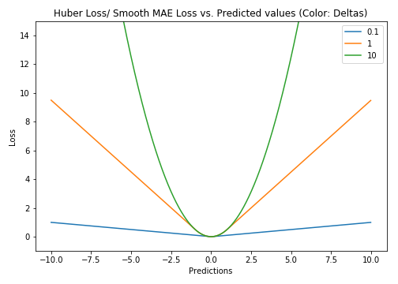

# 损失函数　Loss Functions

```
NOTE 
        n        - Number of training examples.
        i        - ith training example in a data set.
        y(i)     - Ground truth label for ith training example.
        y_hat(i) - Prediction for ith training example.
```
## 回归损失
### 1. Mean Square Error/Quadratic Loss/L2 Loss
$$MSE=\frac{\sum_{i=1}^n (y_i - \hat y_i)^2}{n}$$

- 具有良好的数学性质，便于计算梯度
- 对于离群点有较大的相应　　

### 2. Mean Absolute Error/L1 Loss
$$MAE=\frac{\sum_{i=1}^n |y_i - \hat y_i|}{n}$$

- 相比于ＭＳＥ，对于利群点更具有鲁棒性(没有开平方)
- 需要更复杂的工具去计算梯度（linear programming），函数不连续，原点不好求导
- 更新的梯度始终相同，也就是说，即使对于很小的损失值，梯度也很大。这样不利于模型的学习。为了解决这个缺陷，我们可以使用变化的学习率，在损失接近最小值时降低学习率
 

### 3. Huber Loss 
$$L_\delta=\begin{cases}
\frac{1}{2}(y-\hat y)^2, & for\ |y-\hat y| \le \delta \\[1ex]
\delta|y-\hat y|-\frac{1}{2}\delta^2, & otherwise
\end{cases}$$

- delta决定了利群点的定义。当残差大于delta，采用L1（对较大的异常值不那么敏感）来最小化，而残差小于超参数，则用L2来最小化
- 比起MSE，它对异常点更加鲁棒。因此，Huber损失结合了MSE和MAE的优点。
- 可能需要不断调整超参数delta
- 某些点二阶不可导
 

### 4. Log-Cosh Loss
预测误差的双曲余弦的对数
$$L=\sum_{i=1}^nlog(cosh(\hat y_i -y_i))$$  
- log(cosh(x)) is approximately equal to (x ** 2) / 2 for small x and to abs(x) - log(2) for large x
- 具有Huber Loss的优点，所有点二阶可导
(例如，在XGＢoost,使用牛顿法优化，需要计算二阶导)
- 误差很大的话，一阶梯度和Hessian会变成定值
 

### 5. 分位数损失　Quantile Loss
专注于预测区间而不是具体值

$$L_\gamma =\sum_{i:y_i<\hat y_i} (1-\gamma)|y_i-\hat y_i| +\sum_{i:y_i\ge\hat y_i}(\gamma)|y_i-\hat y_i|$$
使用最小二乘回归进行区间预测，基于的假设是残差（y-y_hat）是独立变量，且方差保持不变。
一旦违背了这条假设，那么线性回归模型就不成立。但是我们也不能因此就认为使用非线性函数或基于树的模型更好，而放弃将线性回归模型作为基线方法。
这时，分位数损失和分位数回归就派上用场了，
- 因为即便对于具有变化方差或非正态分布的残差，基于分位数损失的回归也能给出合理的预测区间。


## 二分类分类损失
### 1. 0-1 loss
$$
L(Y,f(X)) =
\begin{cases}
0, & y = \hat y \\[1ex]
1, & y \ne \hat y
\end{cases}
$$
- 不可导
 
### 2. Hinge Loss
通常被用于最大间隔算法(maximum-margin)，而最大间隔算法又是SVM用到的重要算法
Hinge loss专用于二分类问题，标签值y=±1，预测值$\hat y∈R$。该二分类问题的目标函数的要求如下：
- 当$\hat y$大于等于+1或者小于等于-1时，都是分类器确定的分类结果，此时的损失函数loss为0；
- 而当预测值y^∈(−1,1)y^∈(−1,1)时，分类器对分类结果不确定，loss不为0。显然，当y^=0y^=0时，loss达到最大值

$|\hat y|$越大，说明样本点离分割超平面越远，即该样本点很容易被分类。但是，我们在选择合适的损失函数进行优化时，没必要关注那些离超平面很远的样本。为此，我们可以通过对距分离超平面的距离选择一个阈值，来过滤这些离超平面很远的样本。这就是Hinge loss的精髓，下面式中的1就是我们选择的阈值，这个可以作为一个超参数。通过一个max(0, )函数，忽略$\hat y$值过高的情况。

$$L=max(0, 1-y.\hat y)$$

## 多分类问题损失　
### 1. Multi class Hinge Loss / SVM Loss
对于多分类问题，现在要用这些数据做一个 k 类的线性分类器

$s∈R^k$，s为预测向量，每个分量代表分类器在该类别的得分
样本$x_i$的标签  $y_i∈R^k$ , 这里若 xi 属于类别 k ，则 yi 中除了第 k 个分量外其余元素全为 0
$s_j$ 表示预测出的得分向量 s 中的第 j 个分量
$s_{y_i}$ 表示对应$y_i=1$的分量,即正确标签对应的位置下，预测出的值

则单个样本多分类的Hinge Loss可表示为:

$$L = \sum_{j\ne y_i} max(0, s_j-s_{y_i}+1)$$

```
## 1st training example
max(0, (1.49) - (-0.39) + 1) + max(0, (4.21) - (-0.39) + 1)
max(0, 2.88) + max(0, 5.6)
2.88 + 5.6
8.48 (High loss as very wrong prediction)

## 2nd training example
max(0, (-4.61) - (3.28)+ 1) + max(0, (1.46) - (3.28)+ 1)
max(0, -6.89) + max(0, -0.82)
0 + 0
0 (Zero loss as correct prediction)

## 3rd training example
max(0, (1.03) - (-2.27)+ 1) + max(0, (-2.37) - (-2.27)+ 1)
max(0, 4.3) + max(0, 0.9)
4.3 + 0.9
5.2 (High loss as very wrong prediction)
```

### 2. Cross Entropy Loss/Negative Log Likelihood
信息量：
$$I(x)=-log\ p(x)$$
熵的定义：
它是表示随机变量不确定的度量，是对所有可能发生的事件产生的信息量的期望
$$H(x)=-p(x)log\ p(x)$$
交叉熵：
现在有关于样本集的两个概率分布 p(x) 和 q(x)，其中  p(x) 为真实分布， q(x) 非真实分布。如果使用非真实分布 q(x) 来表示来自真实分布 p(x) 的平均编码长度，则是
$$H(p,q)=-\sum_x p(x)log(q(x))$$  

### 3. Kullback–Leibler (KL) divergence
相对熵可以用来衡量两个概率分布之间的差异，上面公式的意义就是求 p 与 q 之间的对数差在 p 上的期望值
$$D_{KL}(p||q)=\sum_x p(x)log\frac{p(x)}{q(x)}$$

- 如果 p(x) 和 q(x) 两个分布相同，那么相对熵等于0
- 相对熵具有不对称性
- $D_{KL}(p||q)\ge 0$

与交叉熵的关系：
$$H(p,q)=H(p)-D_{KL}(p||q)$$  

并且当 H(p) 为常量时（注：在机器学习中，训练数据分布是固定的），最小化相对熵 DKL(p||q) 等价于最小化交叉熵 H(p,q) 也等价于最大化似然估计


## 其他问题
１. 为什么二元分类不使用MSE?
原因一：
二分类使用sigmoid/logistic函数，和MSE一起使用时会出现梯度消失。
原因如下：
MSE对参数的偏导:
$$\frac{\partial c}{\partial w}=(a-y)\sigma(z)'x$$
$$\frac{\partial c}{\partial b}=(a-y)\sigma(z)'$$
corss-entropy对参数的偏导:
$$\frac{\partial c}{\partial w}=\frac{1}{n}\sum x(\sigma(z)-y)$$
$$\frac{\partial c}{\partial b}=\frac{1}{n}\sum (\sigma(z)-y)$$
在使用MSE时，w、b的梯度均与sigmoid函数对z的偏导有关系，而sigmoid函数的偏导在自变量非常大或者非常小时，偏导数的值接近于零，这将导致w、b的梯度将不会变化，也就是出现所谓的梯度消失现象。而使用cross-entropy时，w、b的梯度就不会出现上述的情况。所以MSE不适用于分类问题
原因二：
函数非凸，有局部最优点