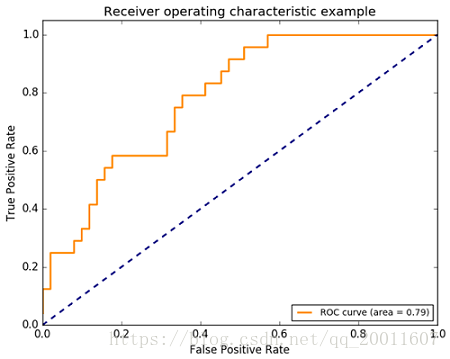
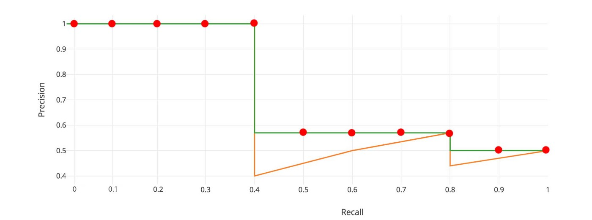
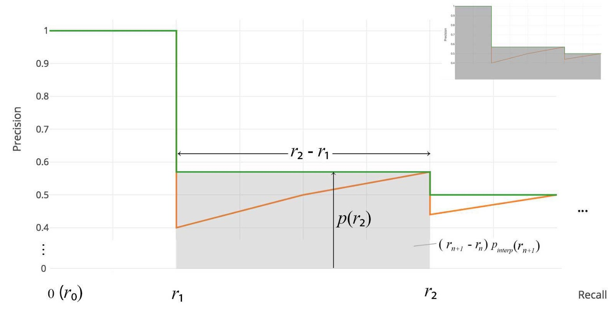
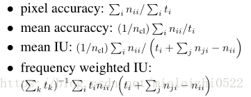
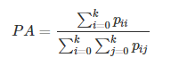
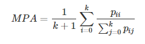
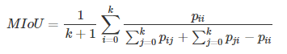
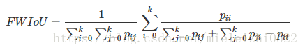

# 分类指标
混淆矩阵
|     | Predicted as Positive  |Predicted as Negative|
|  ----  | ----  |----|
| Labeled as Positive  | True Positive(TP) |False Negative(FN)|
| Labeled as Negative  | False Positive(FP) |True Negative(TN)|
召回率(Recall)/真正率：$$TPR=\frac{TN}{FP+TN}$$
精确率,查准率(Precision):$$P=\frac{TP}{TP+FP}$$
准确率(Accuracy)：$$ACC=\frac{TP+TN}{TP+FN+TN+FP}$$
错误率：$$Error=\frac{FN+FP}{TP+FN+TN+FP}$$
F1-Score:它是精确率和召回率的调和平均数，最大为1，最小为0
$$F1=2\frac{Precision*Recall}{Precision+recall}$$
#### ROC(Receiver Operating Characteristic):
常用来评价一个二值分类器的优劣。对于不同的分类阈值，对于下图中的一个点，阈值变化生成下图。
计算方式：假设已经得出一系列样本被划分为正类的概率，然后按照大小排序，从高到低，依次将网络预测的概率值作为阈值threshold，当样本属于正样本的概率大于或等于这个threshold时，我们认为它为正样本，否则为负样本。这样计算多个点。
优点：当测试集中的正负样本的分布变化的时候，ROC曲线能够保持不变。

AUR（Area Under Curve）：ROC曲线下的面积。
AUC值是一个概率值，当你随机挑选一个正样本以及一个负样本，当前的分类算法根据计算得到的Score值将这个正样本排在负样本前面的概率。

#### Rank-N 准确度
Rank-1：指的是，对于模型预测的结果排序，top-1的分数预测作为预测结果，判断对错；
Rank-5：对于模型预测的结果排序，前top-5的分数预测结果中如果含有正确的分类，判断为正；
原因：数据集中含有相似的分类，界限模糊。

#### mAP
- Average Precision
对于一个类别来说，AP同AUR类似，只不过是precision and recall图线下的面积

- voc方法
假设这N个样本中有M个正例，那么会得到M个recall值（1/M, 2/M, ..., M/M）,对于每个recall值r，可以计算出对应（r' > r）的最大precision，然后对这M个precision值取平均即得到最后的AP值

  
- COCO
对于图像检测，IOU作为分类的阈值。COCO，AP@[.5:.95]意思为10个梯度，从0.5-0.95IOU，然后计算同上。
- mAP
就是多个类别的AP的平均值
# 分割指标

假设如下：共有k+1个类（从L0到Lk，其中包含一个空类或背景），pij表示本属于类i但被预测为类j的像素数量。即，pii表示真正的数量，而pij  pji则分别被解释为假正和假负，尽管两者都是假正与假负之和。
- Pixel Accuracy(PA，像素精度)：这是最简单的度量，为标记正确的像素占总像素的比例

- Mean Pixel Accuracy(MPA，均像素精度)：是PA的一种简单提升，计算每个类内被正确分类像素数的比例，之后求所有类的平均

- Mean Intersection over Union(MIoU，均交并比)：为语义分割的标准度量。其计算两个集合的交集和并集之比，在语义分割的问题中，这两个集合为真实值（ground truth）和预测值（predicted segmentation）。这个比例可以变形为正真数（intersection）比上真正、假负、假正（并集）之和。在每个类上计算IoU，之后平均

- frequency weighted IU
