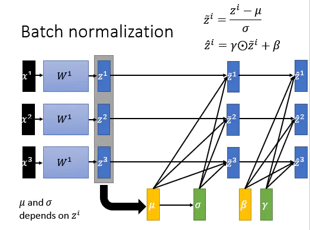
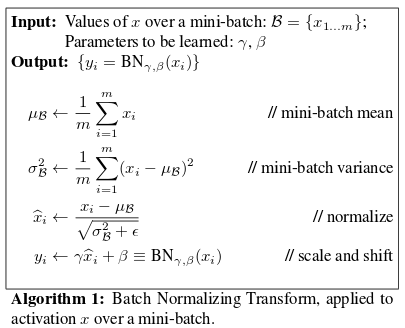
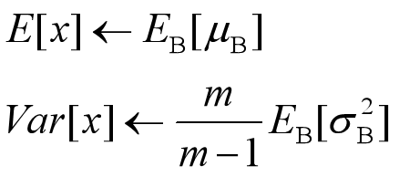
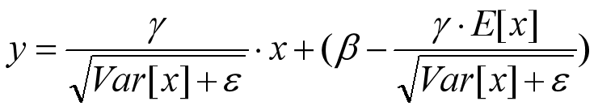

## 1. Batch Normalization
### 1.1 使用原因
- 提升训练速度
- covariance shift
对于一个网络，当输入的分布改变时，其将无法预测，需要进行重新训练。同理，对于网络中的隐藏层来说，他的输入是上一层的输出，然而在网络的训练过程中，每一层的权重都在变化（internal covariant shift），对于下一层来说，其输入分布也就发生了变化，这个会影响网络收敛
- 梯度消失、爆炸
由于一些激活函数的原因，当输入的值很大或者很小时，梯度消失、爆。随着网络深度加深或者在训练过程中，隐藏层输出的分布逐渐发生偏移或者变动，一般是整体分布逐渐往非线性函数的取值区间的上下限两端靠近，导致训练缓慢
- 使得对参数的定义的initialization影响是比较小
### 1.2 过程
#### 1.2.1 训练时
一般在激活层之前使用
对于一个mini batch，在每个特征维度上进行normalization。
例如，一个数据在某曾的输出为n个feature，对于每个feature，都在batch维度上进行normalization。
单纯normalization，会使得网络失却表征能力（representation），退化成线性（例如sigmoid函数，当归一化后，输入集中在原点附近，函数近似直线）。所以，增加了两个可学习的参数$\gamma \ \beta$



#### 1.2.2 推理时
由于输入只有一个，无法计算均值和方差，所以使用之前训练集的所有数据计算均值和方差。
- 计算方法一
记录每个mini batch的均值和方差，然后进行如下计算，m使一个batch中样本的个数

- 计算方法二
由于很难记录所有batch的均值和方差（内存原因），使用另外一种方式,（大部分框架使用的方式）：exponential weighted average：
其中$\alpha$为 momentum，一般为0.9；
$\mu_{B}$当前batch的均值  
  

然后推理时，稍微换种计算形式.本质上就是数学变换，公式还是之前的，这么做的原因是减少不必要的计算，因为以下形式中，除了x，其余都是固定值，可以提前计算。

#### 1.2.3 对于卷积层
对于每一个feature map做normalization，假设$batch size=m，map size=q*p$，则计算均值和方差时，所对应的$set\ size= m*q*p$。理由是由于卷积操作的性质，其在feature map上共享卷积层。
```
# t is still the incoming tensor of shape [B, H, W, C]
# but mean and stddev are computed along (0, 1, 2) axes and have just [C] shape
mean = mean(t, axis=(0, 1, 2))
stddev = stddev(t, axis=(0, 1, 2))
for i in 0..B-1, x in 0..H-1, y in 0..W-1:
out[i,x,y,:] = norm(t[i,x,y,:], mean, stddev)
```
### 1.3 背后原理
- 同特征工程一样，将特征归一化有助于加速收敛
- 通过对隐藏层的输入进行mini-batch维度上的normalization，消除了covariance shift，让每层网络学习时更加独立
- 将隐藏层的输入的分布拉回到了激活函数的有效响应区间，这样可以使用更大的学习率
- 减少了过拟合。因为是在mini-batch维度上的操作，对于不同的batch，计算出的均值，方差等参数都不一样，变相的添加了noise。
