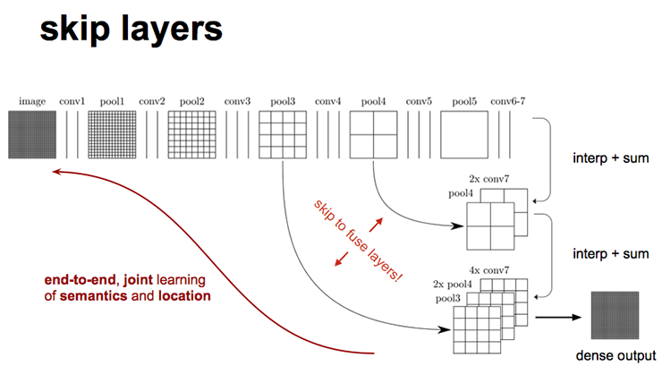
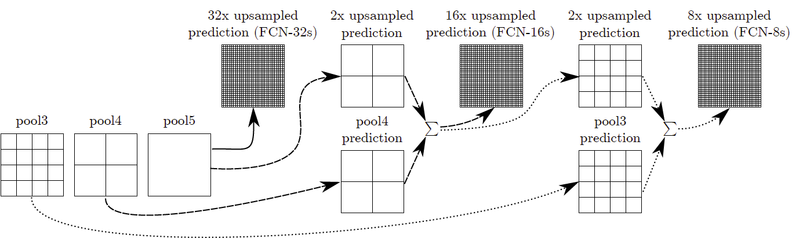

# Fully Convolutional Networks
- 语义分割

## 网络结构
虚线上半部分为全卷积网络。（蓝：卷积，绿：max pooling）。对于不同尺寸的输入图像，各层数据的尺寸（height，width）相应变化，深度（channel）不变。

## 将全连接层变为卷积层
对于经典网络AlexNet-把最后两个全连接层（fc）改成了卷积层：
- 针对第一个连接区域是[7x7x512]的全连接层，令其滤波器尺寸为F=7，这样输出数据体就为[1x1x4096]了；
- 针对第二个全连接层，令其滤波器尺寸为F=1，这样输出数据体为[1x1x4096]；
- 对最后一个全连接层也做类似的，令其F=1，最终输出为[1x1x1000]

## transport convolution
上采样使用 transport convolution

## 多尺度融合

下图对应三个网络

## 预测分割
假设类别c=20+1(背景),则最后输出的对应深度数目的heat map，每一个张对应一个类别，预测时通过逐个像素地求其在c张图像该像素位置的最大数值描述（概率）作为该像素的分类，因此产生了一张已经分类好的图片。

## loss
对每个像素点做softmax loss，所以batch size是一张图片

## 缺点
- 得到的结果还是不够精细。进行8倍上采样虽然比32倍的效果好了很多，但是上采样的结果还是比较模糊和平滑，对图像中的细节不敏感。

- 对各个像素进行分类，没有充分考虑像素与像素之间的关系。忽略了在通常的基于像素分类的分割方法中使用的空间规整（spatial regularization）步骤，缺乏空间一致性。