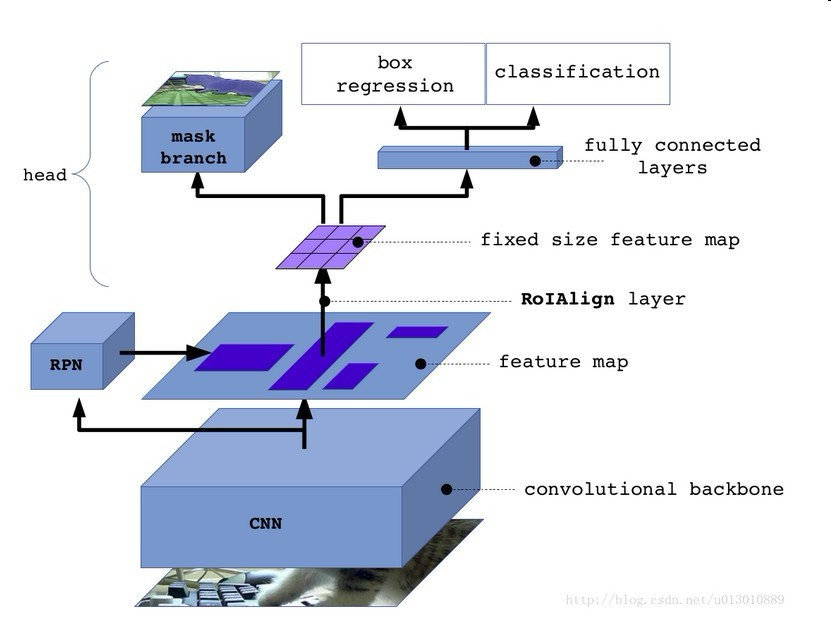
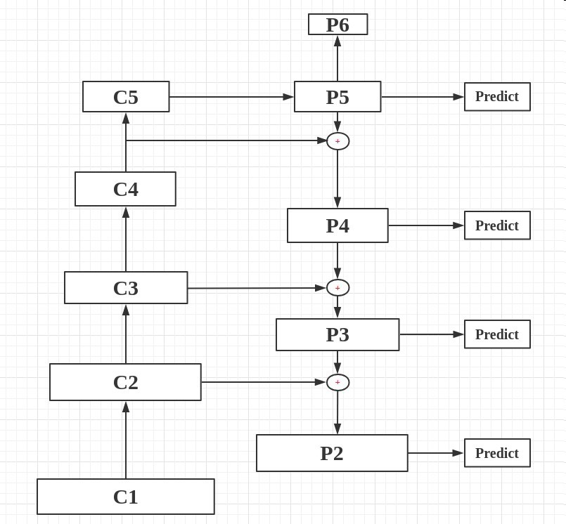
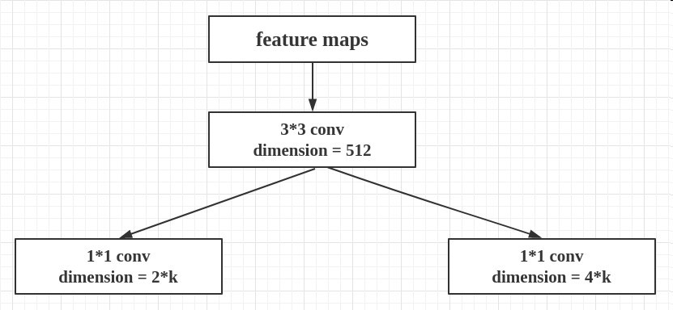
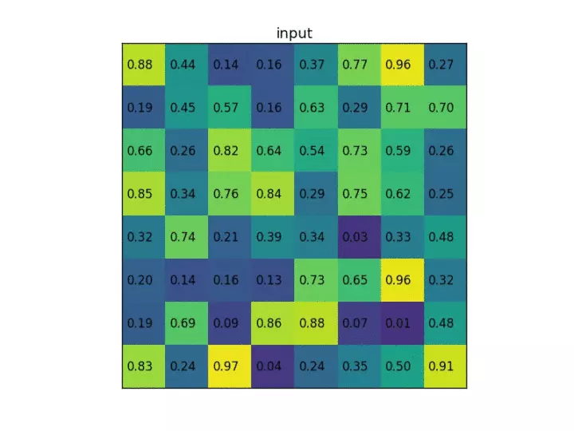
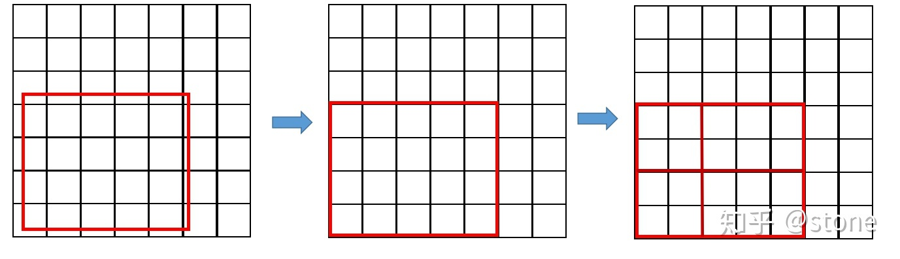
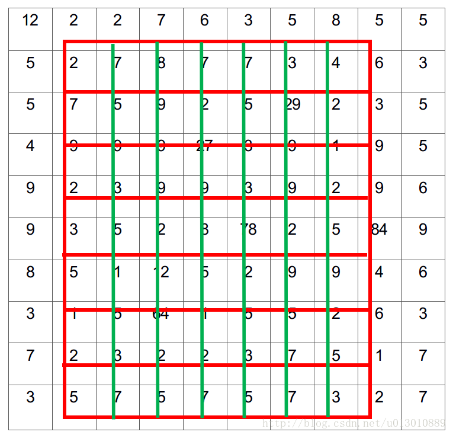
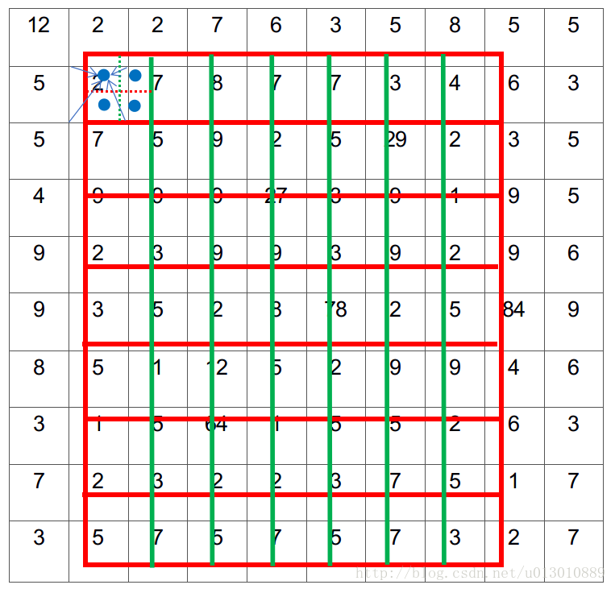
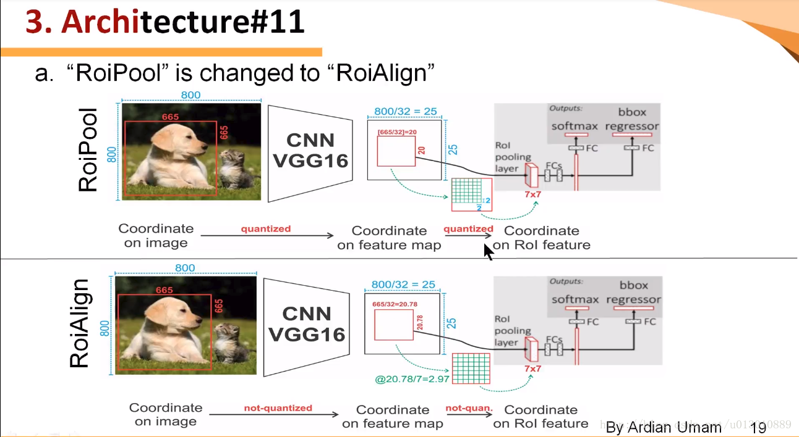
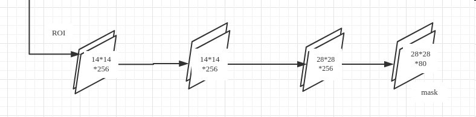

# Mask R-Cnn
实例分割 Instance Segmentation
## 网络结构

### 1. backbone
- Resnet101 Resnext
- FPN （可选项，也可以不用）

- RPN

### 2. ROIAlign
- ROIPooling的问题
RoI pooling中出现了两次的取整，第一次是降原图上的ＲＯＩ推导到feature map上的时候，第二次时在feature map上作pooling的试试。虽然在feature maps上取整看起来只是小数级别的数，但是当把feature map还原到原图上时就会出现很大的偏差。

- ROIAlign
ROI Align方法取消整数化操作，保留了小数，使用双线性插值的方法获得坐标为浮点数的像素点上的图像数值。从原图到feature map时，保留小数；
1. 目的是生成７＊７的pooling,下图黑色为feature map,红色为ROI,划分7*7的bin(这里ROI的的坐标不用量化）

2. 接着是对每一个bin中进行双线性插值，得到四个点（在论文中也说到过插值一个点的效果其实和四个点的效果是一样的，在代码中作者为了方便也就采用了插值一个点）
3. 通过插完值之后再进行max pooling得到最终的7*7的ROI，即完成了RoIAlign的过程

### 3. classifier
同faster-rcnn

### 4. mask branch
mask的预测也是在ROI之后的，通过FCN来进行的。
实现的语义分割而不是实例分割。因为每个ROI只对应一个物体，只需对其进行语义分割就好，相当于了实例分割了，这也是Mask-RCNN与其他分割框架的不同，是先分类再分割。
并且这样做的话是为了减弱类别间的竞争，从而得到更加好的结果。
生成与类别相同深度的二值特征输出。

## 训练
该模型的训练和预测是分开的，不是套用同一个流程。在训练的时候，classifier和mask都是同时进行的；在预测的时候，显示得到classifier的结果，然后再把此结果传入到mask预测中得到mask，有一定的先后顺序。
### 1. loss
$$L=L_{cls}+L_{box}+l_{mask}$$
假设一共有K个类别，则mask分割分支的输出维度是 $k*m*m$ , 对于 $m*m$ 中的每个点，都会输出K个二值Mask（每个类别使用sigmoid输出）。
需要注意的是，计算loss的时候，并不是每个类别的sigmoid输出都计算二值交叉熵损失，而是该像素属于哪个类，哪个类的sigmoid输出才要计算损失。
对于预测的二值掩膜输出，我们对每个像素点应用sigmoid函数，整体损失定义为平均二值交叉损失熵。
并且在测试的时候，我们是通过分类分支预测的类别来选择相应的mask预测。这样，mask预测和分类预测就彻底解耦了。

## reference
[paper](http://cn.arxiv.org/pdf/1703.06870v3)
[blog](https://blog.csdn.net/remanented/article/details/79564045)
[blog](https://blog.csdn.net/u011974639/article/details/78483779?locationNum=9&fps=1)