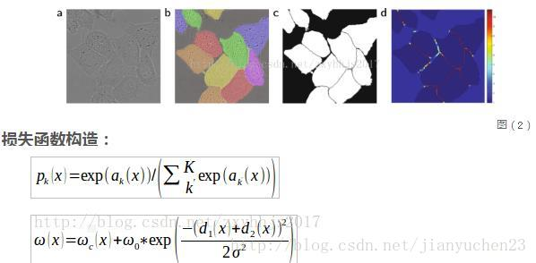
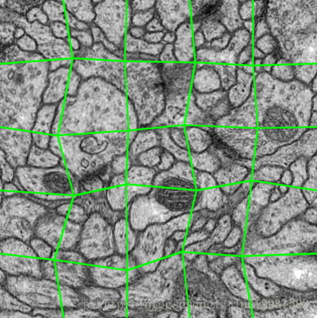

# U-Net

- 通过图片增强，使用较少的训练集即可训练网络

## 网络结构

- contracting path （左边）:
３x3卷积，no padding;
在maxpooling之后，2x通道深度

- expansive path　（右边）：
upsampling:使用deconvolution,同时减少一般的通道深度
与对应的**剪切**过得feature map进行concatenation;剪切是由于卷积过程中图像变小了

## loss
二分类网络，输出为：两通道原图大小的feature maps
loss:对每个像素进行softmax操作，其后进行交叉熵计算
$$E=\sum_{x\in class}w(x)log(p_{l(x)}(x))$$

$w(x)$:每个像素点的权重，平衡在同类别中像素出现的频率，同时使网络倾向于学习更小的分割边界，即在细胞边界附近的像素点给的权重会大一些，离细胞比较远的像素点的权重会小一些,因为，如果同类细胞贴的比较近，可能就会增大训练的难度，减少准确率，毕竟卷积会考虑该像素点周围的一些特征，而两个相同的类的细胞贴在一起，就容易误判，所以对这种两个相同类贴在一起的细胞边界，给予较大的权重，使的训练之后分类分割更准确.

## 数据增强
输入边界采用镜像padding
弹性变形

## reference 
[paper](https://arxiv.org/pdf/1505.04597.pdf)