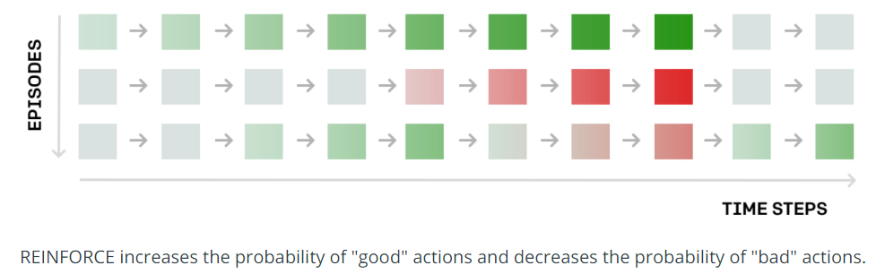
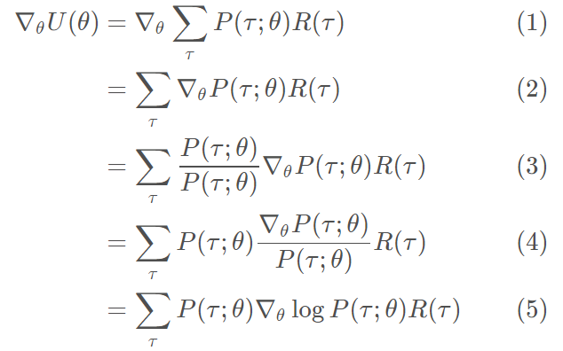
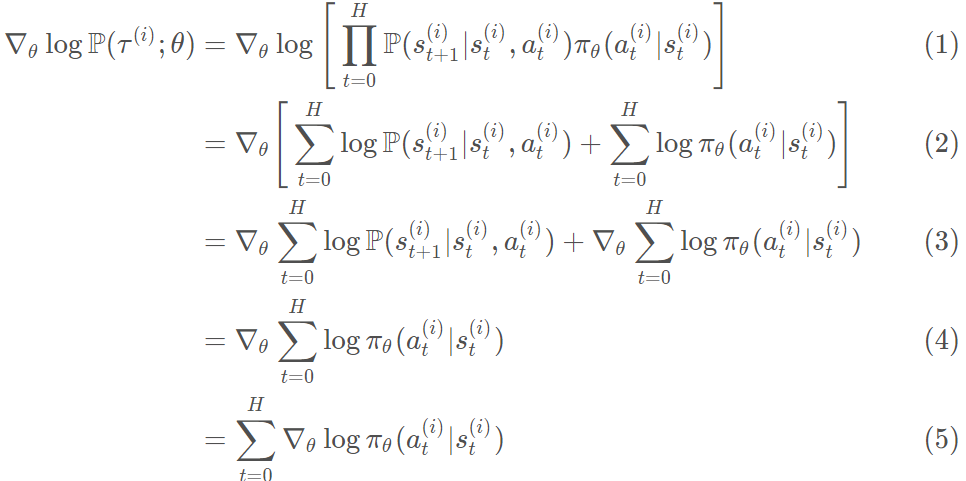
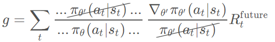
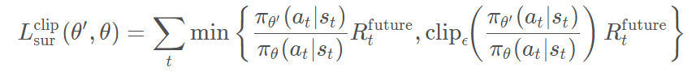

# 基于策略的方法 Policy-Based Methods
Policy Function Approximation:
$$State \to^{networks} Actions$$
使用神经网络代表策略
* state作为输入
* 离散动作：输出对应每个动作的概率
* 连续动作： 输出动作数值  
    
目标方程(objective function):
* 寻找网络参数$\theta$，最大化期望返回$J = J(\theta)$  
  
区别：
* 基于值方法： 通过学习Q-value间接得到
* 基于策略方法： 直接学习最优策略  

优点：
* Simplicity
* Stochastic policies: 可以学习真正的随机策略(stochastic policies)
* Continuous action spaces: 适合连续空间动作

## Policy Gradient free Methods
简单的算法有：
* Hill Climbing
每次随机采样$\theta$,如果性能有提升，则更新$\theta$;否则，不更新
* Steepest Ascent Hill climbing
每次在当前$\theta$周围采样多个点，选取表现最好的更新
* Simulated annealing 
采样时，以某种方式，持续的减少exploration的范围
* Adaptive noise scaling 
采样时，当发现新的$\theta_{best}$时，减少搜索半径;否则增加
* Cross-Entropy Method
每次在当前$\theta$周围采样多个点，选取表现最好前$N%$的样本参数，取均值更新
* Evolution Strategies  

## Policy Gradient Methods
based on the gradient
##### definition：
Trajectory: 一连串的状态-动作对
    $$\tau =(s_0, a_0, s_1, a_1, ... s_H, a_H, s_{H+1})$$

轨迹的奖励Reward of trajectory:
    $$R(\tau)=r_1+r_2+...+r_H$$

Horizon H: length of trajectory
目标值（Expected Return）:
    $$U(\theta) = \sum_\tau P(\tau; \theta)R(\tau)$$ 

$P(\tau; \theta)$ 是一个轨迹被生成的概率，与$\theta$有关
目标: 寻找最大化目标值$U(\theta)$的$\theta$
###### 大致流程：
```
LOOP:
    Collect trajectory;
    update weights of the policy networks:
        increase/decrease the probability of each (state,action) combination according to the reward R
``` 

### 算法一： Reinforce
使用梯度上升**gradien ascent**的方法：
$$\theta \leftarrow \theta + \alpha \nabla_\theta U(\theta) $$  

由于计算梯度需要所有可能发生的轨迹是不可能的，所以可以使用一些轨迹来估计梯度。  
##### Pseudocode
1. 使用当前policy $\pi_\theta$生成m条trajectories {${\tau^1, \tau^2 ... \tau^m}$},长度Horizon为 H。

2. 使用这些trajectories去估计梯度
        $$\nabla_\theta U(\theta)\approx \hat g=\frac 1 m \sum_{i=1}^{m} \sum_{t=0}^H \nabla_\theta log\pi_\theta (a_t^i|s_t^i).R(\tau^i) $$  

3. 更新权重$\theta$
    $$\theta \leftarrow \theta + \alpha \hat g$$
4. 重复步骤1-3  


##### 缺点：
1. 效率低：每此更新生成的轨迹使用一次后废弃。理由是我们需要计算当前的策略，一次轨迹必须是可以表示当前策略的，换句话说，他必须由当前策略生成。由于更新后的策略改变了，之前策略生成的轨迹不在适用。
2. 由于生成的轨迹不是最优策略下生成的，因此使用这些轨迹计算出的梯度充满噪声，不准确也不稳定
3. no credit assignment. 同个轨迹下包含了很多好或者坏的动作，但reinforce只根据轨迹最终的reward判断好坏  
##### 改进：
* Noise Reduction:
  1. 理论上来说，根据公式，梯度是根据所有可能的轨迹的均值计算出来的，然而现实不可能求出所有轨迹。因此，尽可能多的采集轨迹，是最简单的方式去减少噪音。
$$\hat g=\frac 1 m \sum_{i=1}^{m} R(\tau^i)\sum_{t=0}^H \nabla_\theta log\pi_\theta (a_t^i|s_t^i)$$  
  1. 轨迹奖励归一化(Rewards Normalization)。$$R_i = \frac{R_i-\mu }{\sigma}$$同理batch-normalization

* Credit Assignment
因为是Markov过程，在t时刻的action，只会影响以后的reward，所以在此之前的reward不应该考虑。新的梯度变为：
$$g=\sum_t R^{Future}_t \nabla_{\theta} log \pi_{\theta}(a_t|s_t)$$虽然对于单独的轨迹，其梯度改变了，但不会改变所有轨迹的平均梯度。
* Importance Sampling
解决在缺点1中提到的点，统计学中常用方法，目的是在两个不同的distribution中，根据其中一个计算里外一个期望。  
对于新的策略$\theta'$下，计算U：
    $$\sum_\tau P(\tau ; \theta')R(\tau)$$
变形可得：
    $$\frac{P(\tau ; \theta')}{P(\tau ; \theta)}\sum_\tau P(\tau ; \theta) R(\tau)$$

    因此可以根据老的策略轨迹来更新新的策略，只要乘上轨迹在新老策略被取得概率的比值，**re-weighting factor**
    $$\frac{P(\tau ; \theta')}{P(\tau ; \theta)}=\frac{\pi_{\theta'}(a_1|s_1)\pi_{\theta'}(a_2|s_2)...}{\pi_{\theta}(a_1|s_1)\pi_{\theta}(a_2|s_2)...}   $$

##### 公式推导
* likelihood ratio policy gradient  

公式（4）中，利用此公式：$$\nabla_x logf(x)=\frac{\nabla_x f(x)}{f(x)}$$

* Sample-based Estimate
likelihood ratio gradient可以被近似估计：
$$\nabla_{\theta}U(\theta) \approx \frac{1}{m} \sum_{i=1}^m \nabla_{\theta} logP(\tau^i ;\theta)R(\tau^i) $$

* 继续化简
    

### 算法二：Proximal Policy Optimization
整体算法同Reinforce，只是计算梯度的方法不同，其可利用old trajectory去更新当前策略。
##### Re-weighting the Policy Gradient
根据importance sampling，新的策略下的梯度为：
$$g=\frac{P(\tau ; \theta')}{P(\tau ; \theta)} \sum_t \frac{\nabla_{\theta'}\pi_{\theta'}(a_t|s_t)}{\pi_{\theta'}(a_t|s_t)}R^{future}_t $$


当新老两个策略非常接近时，上式中的“...”部分约等于1，则最终梯度为：
$$g=\sum_t \frac{\nabla_{\theta'}\pi_{\theta'}(a_t|s_t)}{\pi_{\theta}(a_t|s_t)}R^{future}_t $$

虽然形式上看起来一样，但其实还是不同于先前的梯度表达式，因此可以取名, **Surrogate Function**，近似替代梯度：
$$L_{sur}(\theta', \theta)=\sum_t \frac{\nabla_{\theta'}\pi_{\theta'}(a_t|s_t)}{\pi_{\theta}(a_t|s_t)}R^{future}_t$$  $$g=\nabla_{\theta'} L_{sur}(\theta', \theta)$$

##### Clipping Policy Updates (called PPO2)
当新老策略变得差距越来越大时，surrogate function会有很大的估计error，其将不再适用。

解决方法是，当surrogate超出一定范围后，固定输出，使其梯度为零不再往错误的方向更新，避免过大梯度估计误差。

因此有，**Clipped Surrogate Function**：


##### 算法过程
1. First, collect some trajectories based on some policy$\pi_{\theta}$, and initialize $\theta' = \theta$
2. Next, compute the gradient of the clipped surrogate function using the trajectories
3. Update $\theta'$using gradient ascent$\theta' \leftarrow \theta' + \alpha \nabla_{\theta'} L_{sur}^{clip}(\theta', \theta)$
4. Then we repeat step 2-3 without generating new trajectories. Typically, step 2-3 are only repeated a few times
5. Set $\theta = \theta'$, go back to step 1, repeat.