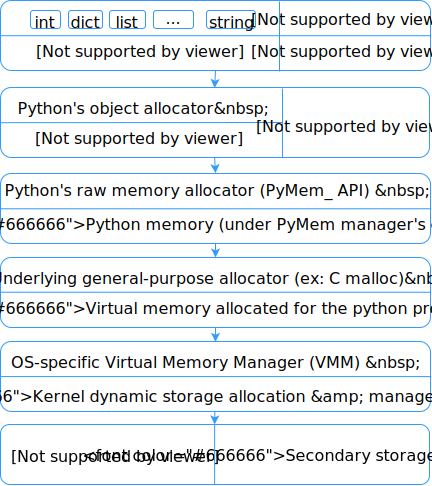
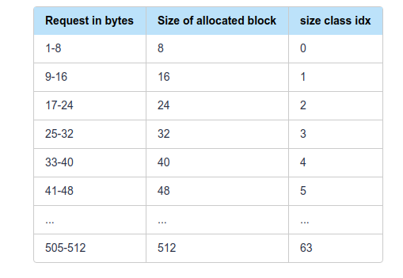
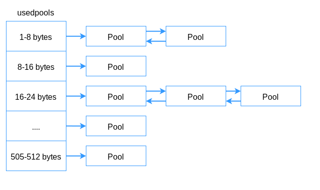
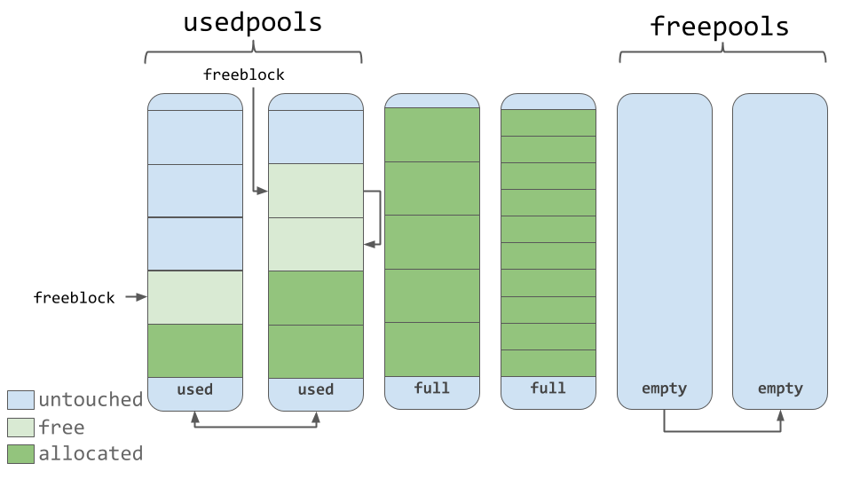
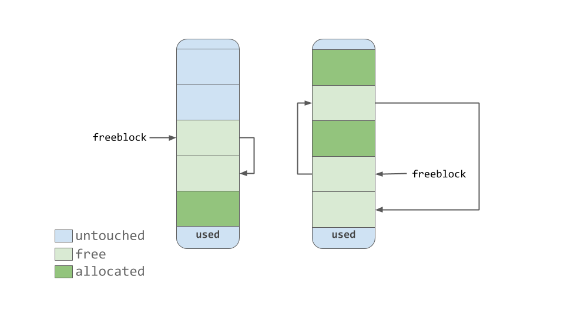
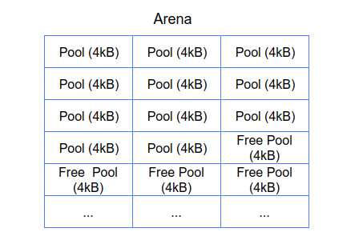
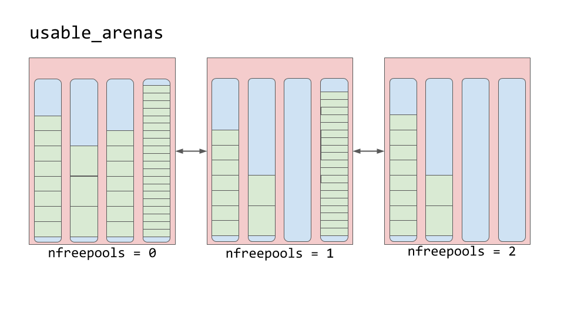

## 1.内存管理机制
### 1.1 heap and stack
一般来说，对于大的变量，或者需要改变大小的变量，过着全局变量，使用heap;而对于小的，局部变量，使用stack.
- stack
由ｃｐｕ进行管理的一块内存，实行ＬＩＦＯ，无序使用者进行管理，访问速度快；
当一个程序或者方程执行时，其中的变量会ｐｕｓｈ到ｓｔａｃｋ中，当程序结束时，对应的变量ｐｏｐ，无法找回；例外，使用static定义变量；
所以ｓｔａｃｋ中的变量是局部变量；
ｓｔａｃｋ具有大小限制，例如，无限递归栈溢出；
变量大小不可以改变；

- heap
无大小限制；
变量可以被全局访问到；
需要使用者管理，例如c++中的，　new delete;
访问速度相比ｓｔａｃｋ慢，因为需要指针;
内存利用率不高，碎片化；
变量大小可以改变；

### 1.2 Pyobject
python中所有的变量类型在cython中都是Pyobject　struct，其中包含ref cout计算当前引用的个数。所有的变量在python代码中都是reference.
```python
x=1         ##　x引用指向内存中的ｘ
x=x+1       ## 内存中创建一个新的Pyobject，其值为１１，然后x引用指向这个新的
```
### 1.３ 整体构架

在Ｃ malloc之上，就是python　memory,可以支配的内存，除了python需要的一些必要内存占用外，剩下的就是python momery manager进行object管理的内存，这里成为PyMalloc。  

大体上来说，由于动态语言的原因，python的object存储在heap上，程序中的reference存储在stack上，因此需要经常申请调用新的heap内存
1. 所以PyMalloc时是为了提升**小块内存变量**的分配问题;
2. 当需要的分配的object很大时，则调用C malloc接口；
### 1.4 三种抽象结构
#### 1.4.1 block
block是一种固定大小的内存块，每个block只能保存一种固定大小的object.block的大小参考下图。

block有三种状态:
- untouched - 从来没被allocated
- free - 被allocated但是又被"free"掉了,意味着存储的数据不在重要了,对应着下面pool中的freeblock单向链表的增加;
- allocated - 存储着有用的数据
#### 1.4.2 pool
pool使用**多个一样大小**的blocks组成的。这样做时为了防止碎片化(fragmentation)。
```
/* Pool for small blocks. */
struct pool_header {
    union { block *_padding;
            uint count; } ref;          /* number of allocated blocks    */
    block *freeblock;                   /* pool's free list head         */
    struct pool_header *nextpool;       /* next pool of this size class  */
    struct pool_header *prevpool;       /* previous pool       ""        */
    uint arenaindex;                    /* index into arenas of base adr */
    uint szidx;                         /* block size class index        */
    uint nextoffset;                    /* bytes to virgin block         */
    uint maxnextoffset;                 /* largest valid nextoffset      */
};
```
- 具有相同block大小的pool之间，双向指针链接,对应上面的 nexpool prepool。
- 每个pool有三种状态:
    - used-使用部分,但没满
    - full-满了
    - empoty-空
- 存在一个array,叫做usedpools,其按照pool的block size存储used pool的指针;当一个block size的数据要存储时,可以很快找到合适的地方.

- 也存在一个freepools array,存储空的pool的指针
- 单链表freeblcok,记录free的blocks


#### 1.4.3 arenas
arena 是一个包含64个pool的大小为256k的内存块

- arena之间双链表链接,其中,freepools数量越少的arena,排在前面(换句话说,尽量在快满的arena里面分配);这样做的原因是:  

    在pool中,数据的free并不是真正的free,即返还个操作系统,而只是pymalloc里面一些指针的改变(看上面解释);真正的free存在于arena层面,当一个arena全是freepool时,整个arena将会被真正的释放给OS


### 1.5 内存回收 Garbage collection

[参考文章](https://rushter.com/blog/python-memory-managment/)
[参考文章](https://realpython.com/python-memory-management/)

## 2. 全局解释锁 Global interpret lock
cpu-bound:cpu的性能直接决定了程序的性能；例如，计算pi，矩阵计算
i/o-bound：性能受限于i/o相关的subsystem，比如硬盘读取速度，网络通信速度。
### 2.1 为什么有全局锁
首先，python有很多解释器，出名的cthon,jython,pypy,分别由c,java,python写成；
1. 全局解释锁只存于cython,因为要处理很多low-level的处理细节（内存管理，c extension的调用），为了方便，才用了全解解释锁
2. python解释器原因，所有的object在cython中都有一个reference cout变量（记录当前object被引用的个数，当其变成0时，则被“free”）；由于这个cout，在多线程时，没有锁会出现问题
3. 这里只用一个全局锁的原因，如果存在多个锁，有可能出现“死锁”
### 3.1 GIL怎么工作
对于什么时候释放锁，分两种情况：
1. 当一个线程执行到i/o操作时，例如读写，等待网络通信等等，该线程会释放GIL；
2. 如果一个线程是cpu-bound，其一直运行，则解释器会每隔固定的interval，去check线程，释放GIL
对于如何分配下一个锁，对应上面两种情况：
1. i/o线程会等待i/o操作完成，接着进入一个线程priority queue，即操作系统或判断一个优先级，优先级高的会得到解释器分配锁；
2. 由check造成的线程，则也会进入线程queue，如果他的优先级最高，该线程会再次得到锁，继续执行
### 3.2 影响
主要还是影响cpu-bound线程；
i/o-bound线程影响较小，由于其本身需要等待i/o操作，期间可以释放锁；但有问题，及该线程可能在i/o操作后，会花费时间在等待check的到来，从而获取锁
### 3.3 解决方法
使用进程；使用别的解释器

[可视化图片](http://dabeaz.blogspot.com/2010/01/python-gil-visualized.html)
