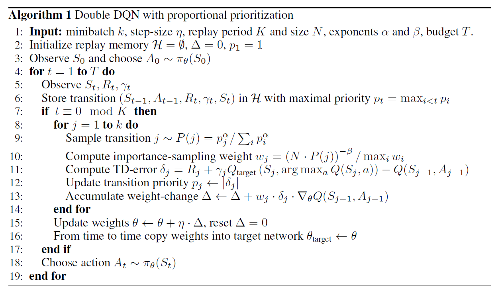

  

# Deep Q-Networks  
基本思想：随着state的增多，action的增多，建立Q-table将不再合适。一种解决方法就是：用神经网络代替Q-table，其接受state输出所有动作的Q值。这种方法称为Deep Q-Networks Learning。

## Experience Replay
通过建立database of samples,并从其中学习mapping，将强化学习问题转化成了监督学习。
* 原因：
    * naive Q-learning使用一组 <S, A, S', R> 后直接抛弃，效率不高，因此可以将所有**经验**存储在replay buffer，并在之后的学习中使用
    * 由于经验之间存在强相关(highly correlated),naive Q-learning面临着Q不收敛的风险
* 解决：
    * 在训练初始阶段，只采集经验，并不学习，尽可能探索。
    * 从replay beffer中随机采样，避免了经验间的相关性。
## Fixed-Target  
首先考虑Q-learning update,其损失函数为
    $$E_\pi [q_\pi(S,A) - \hat q(S,A,w))^2]$$
求导得到梯度：
        $$\nabla_w J(w)=-2(q_\pi(S,A) - \hat q(S,A,w))\nabla_w \hat q(S,A,w)$$
w的更新值为：
$$
\begin{aligned}\Delta w
&=-\alpha \frac{1}{2} \nabla_w J(w) \\
&=\alpha (q_\pi(S,A) - \hat q(S,A,w))\nabla_w \hat q(S,A,w)
\end{aligned}
$$
由上式可看出，$q_\pi$是需要学习的optimal policy,称作TD Target，其应该是与网络参数$w$无关。但实际在D-learning中，其w的更新值为：
    $$\Delta w=\alpha (R+\gamma max\hat q(S',a, w) - \hat q(S,A,w))\nabla_w \hat q(S,A,w)$$
TD Target由$R+\gamma max\hat q(S',a, w)$代替。由于其本身与需要学习的参数$w$有关，并不是真实的optimal policy。所以相当于用一个猜测的值来更新另外一个猜测的值，就像'carrot stick ride',其可能导致不收敛。

* 解决方法
在网络学习(learning step)时，固定TD Target。具体做法，构建另一个一样的网络，称作目标网络(target network)，其参数为$w^-$，并且在网络学习时固定不变，作为TD Target。在经过一段时间后，更新$w^-$。
  
## Algrithm: DQN with fixed target  
- init replay buffer D,capacity N;
- init action-state value function $\hat q$ with random weights $w$;  
- init target action-value weights $w^-$;
- for episode $e \leftarrow 1$ to $M$:
    * for t=1 to T:
        (SAMPLE)
        * get current state $S_t$
        * choose action A using policy $\pi \leftarrow \epsilon -Greedy(\hat q(S_t,A_t,w))$
        * take action $A_t$, get rewoard $R_{t}$, next state $S_{t+1}$
        * store experience tuple $(S_T,A_t,R_t,S_{t+1})$ in D
        * $S_t \leftarrow S_{t+1}$
        (LEARN)
        * if number of experience in D larger than threshod DT:
            * obtain random minibatch of tuples of experience;
            * set target $y_i=r_i+\gamma max_a\hat q (s_{i+1},a,w^-)$
            * update:$\Delta w=\alpha (y_i - \hat q(s_i,a_i,w))\nabla_w \hat q(s_i,a_i,w)$
            * every C steps, soft update $w^- \leftarrow w$
## 改进
#### Double DQN
对于原始DQN，目标值为：
    $$y_i=r_i+\gamma max_a\hat q (s_{i+1},a,w)$$
可写成：
    $$y_i=r_i+\gamma \hat q (s_{i+1},argmax_a \hat q(s_{i+1}, a, w),w)$$
在训练的早期，Q function极大可能不是真实的并且充满噪声，当做argmax操作时，将总是返回过高估计的值，造成Q-value的高估。
* 解决办法：
增加评估网络$w'$,目标为：
    $$y_i=r_i+\gamma \hat q (s_{i+1},argmax_a \hat q(s_{i+1}, a, w),w')$$ 
对应到fixed target DQN：
 $$y_i=r_i+\gamma \hat q (s_{i+1},argmax_a \hat q(s_{i+1}, a, w),w^-)$$ 

#### Prioritized Experience Replay  
对于在buffer中的experience，其重要程度是不一样的.为了可以使重要的经验有更高的几率被sample到，并避免其随着新样本的增加而丢失，可以使用prioritized experience replay. 
首先可以利用TD Error
        $$\delta_t = R_{t+1} + \gamma max_{a\in a}\hat q(S_{t+1}, a, w) - \hat q (S_t, A_t, w)$$来表示重要性(priority): 
        $$p_t = |\delta_t| + e$$取样时，根据每个样本的$Sampling Probility$去选取:
    $$P(i) = \frac {p_i^a}{\sum_k p_k^a}$$

Q值的更新是来自于所有experience的期望(expectation)。当使用随机更新策略时(stochastic update rule),采样的方法必须符合样本本身的分布，uniform sample满足该条件，但是优先回放引入了误差，因为它以一种不受控的形式改变了分布，从而改变了预测会收敛到的 solution（即使 policy 和 状态分布都固定）。我们可以用下面的重要性采样权重（importance-sample weight）来修正该误差：
$$w_i = (\frac {1}{N} \frac {1}{P(i)})^b$$所以，新的更新变成
    $$\Delta w=\alpha w_i \delta_i\nabla_w \hat q(s_i,a_i,w)$$
当新的experience tuple进入buffer时，由于没有$\delta$, 将其优先级设置为最大；当一组experiencetuple被采样更新后，则再用新的$\delta$代表新的优先级，并将该组experience tuple放回buffer中。  

$e$：固定常数；防止$\delta$为0的样本永远不会被采样,对每个样本添加一个小的常数  
$a$: 范围0到1的常数；防止样本过拟合，最终造成一直选取同样的高重要性样本；当a为0时,代表uniform sample; a为1时，代表只考虑priority sample 
$N$: buffer size 
$b$: 范围0到1的数；控制$w_i$的重要性，减少bias的程度。在经典的强化学习的场景下，更新的无偏性是训练最后接近收敛最重要的部分，因此当算法进行到后期收敛时，$w_i$变得越来越重要，所以$b$可以设置为从0到1不断变大。
方法：使用**Sum Tree**数据结构。代码参考[这里](https://github.com/rlcode/per)
。

### Dueling DQN  
由于$V(S)$并不随着action有太大变化，所以直接求出时合理的。而action对state的影响不可忽视，则用优势函数(Advantage Function)表示。  

Dueling DQN考虑将Q网络分成两部分，第一部分是仅仅与状态S有关，与具体要采用的动作A无关，这部分我们叫做价值函数部分，记做$V(S,w,α)$,第二部分同时与状态状态S和动作A有关，这部分叫做优势函数部分,记为$A(S,A,w,β)$,那么最终我们的价值函数可以重新表示为
$$Q(S,A,w,α,β)=V(S,w,α)+A(S,A,w,β)$$其中，w是公共部分的网络参数，而α是价值函数独有部分的网络参数，而β是优势函数独有部分的网络参数。
而在实际中，一般要将动作优势流设置为单独动作优势函数减去某状态下所有动作优势函数的平均值,做一个normalization，使所有的A的和为0。理由是强制网络去训练V(s)，而不是单单聚焦于A，否则A就变相的等于Q:
$$Q(s,a;θ,α,β)=V(s;θ,β)+(A(s,a;θ,α)-\frac{1}{|A|}\sum_{a'}A(s,a';θ,α))$$

## 缺点
1. 不适合连续空间的actions

## paper分析
用神经网络预测Q值  
1. state：为了减少数量，进行一下操作：  
彩图转灰度图； 
图像大小减少；  
由于帧与帧之间存在顺序关系，所以一个state由4帧组成。  
2. Q value  
通过CNN网络生成每个动作的Q value  

### reference
- Mnih, Volodymyr, et al. "Human-level control through deep reinforcement learning." Nature518.7540 (2015): 529. http://www.davidqiu.com:8888/research/nature14236.pdf