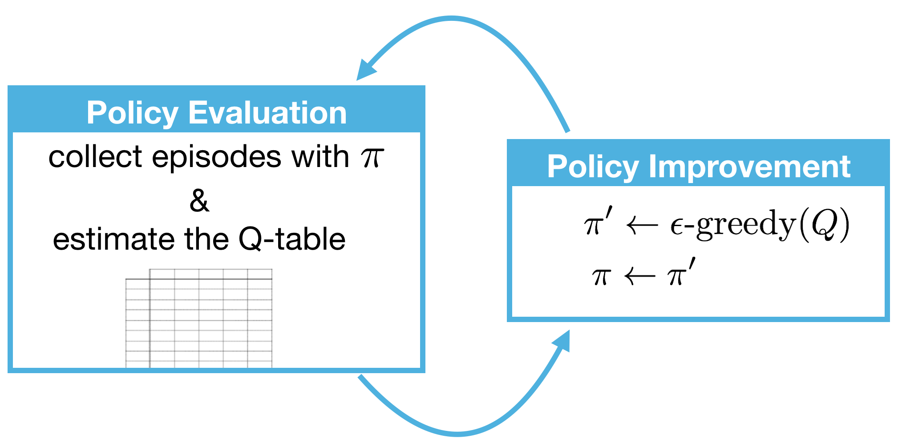

## 蒙特卡罗方法 Monte Carlo Methods  
蒙特卡罗方法又叫统计模拟方法，它使用随机数（或伪随机数）来解决计算的问题，是一类重要的数值计算方法
Off-policy方法
### 蒙特卡罗预测 MC prediction
预测问题 prediction problem: 建立Q table的过程， 即预测Q 或者 V
1. First-visit MC prediction
对于每个episode, 只记录第一次visit到$q(a,s)$的值

2. Every-visit MC Prediction
在每个episode中，如果多次vist$q(a,s)$,则取均值
3. 对比：
- 若episode最够多，两种方法最终都会收敛到最优
- Every-visit MC 是 biased, first-visit MC 是 unbiased 
- 在开始时期, every-visit MC有更低的 mean squared error (MSE), 但随着episode增多, first-visit MC的MSE相比较更低 
### 蒙特卡罗控制 MC Control
控制问题 control problem: 确立最优策略
1. 重复以下过程：
- policy evaluation: 使用$\pi$建立Q-table
- policy improvament: 根据Q-table更新$\pi$

2. 更新$\pi$方法
- greedy policy: 选Q最大的action
        $$a=argmax_{a\in A(s)}Q(s,a)$$
- epsilon greedy policy:  
        $$
        \pi(a|s) =
        \begin{cases}
        z-\epsilon +\frac{\epsilon}{|A|}, & \text{if a maximizes Q(s,a)} \\
        \frac{\epsilon}{|A|} & \text{else}
        \end{cases}$$
        |A|是可选action的数量， $\frac{\epsilon}{|A|}$使所有action概率和为1
3. Exploration-Exploitation Dilemma 
解决思路：使$\epsilon$衰减
4. Greedy in the Limit with Infinite Exploration (GLIE)
满足条件保证MC control可收敛到optimal policy:
    + 所有(state, action)组合被无数次访问;
    + 策略依据Q方程，采用贪心方法收敛
换句话说：
    * $\epsilon_i >0$ for all time steps i;
    * $lim_{i\to \infty}\epsilon_i=0 $
*常用的设置方法*：epsilon-greedy with epsilon annealed linearly from 1.0 to 0.1 over the first million frames, and fixed at 0.1 thereafter
### 5. Incremental Mean
不再是所有episode结束后跟新Q，而是在每次episode结束后更新，方法为：
            $$Q = Q + \frac{1}{N}(G -Q)$$

### 6. constant-alpha
    $$Q = Q + \alpha(G -Q)=(1-\alpha)Q+\alpha G$$
- $\alpha =0$: Q不会更新
- $\alpha =1$: Q将等于最后一次访问的reward(G)
  

## Temporal-Difference Methods
在每次time step更新Q
### TD Control  
### 1. Sarsa
更新方法：
        $$Q(S_t,A_t)=Q(S_t,A_t)+\alpha (R_{t+1}+\gamma Q(S_{t+1},A_{t+1}))-Q(S_t,A_t)$$
### 2. Q-learning (Sarsamax)
更新方法：
    $$Q(S_t,A_t)=Q(S_t,A_t)+\alpha (R_{t+1}+\gamma max_{a\in A}Q(S_{t+1},a))-Q(S_t,A_t)$$
### 3. Expected Sarsa
更新方法：
    $$Q(S_t,A_t)=Q(S_t,A_t)+\alpha (R_{t+1}+\gamma \sum_{a\in A}\pi (a|S_{t+1})Q(S_{t+1},a))-Q(S_t,A_t)$$
4. 对比
- on-policy: sarsa 和 expected sarsa
- off-policy: sarsamax
- expected sarsa 整体上比 sarsa 表现好
**Tip: Optimism: 初始化Q-table的值为大值，将会有好的算法性能**