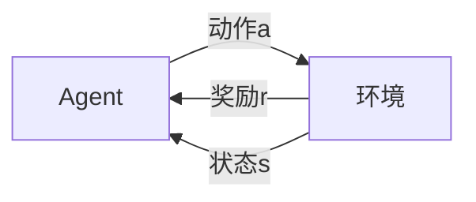

# 介绍
## 马尔可夫决策过程(Markow Decision Process, MDP)
### 基本定义：

- 状态空间$D$
$S^+$：所有状态，包括最终  
$S$： 非最终状态  
- 动作空间$A$，
- one-step dynamics： 状态之间转换的概率  
        $$ p(s',r|s,a)=P(S_{t+1}=s', R_{t+1}=r | S_t=s, A_t =a)$$
- 奖励$r$
- Discount rate$\gamma \in [0,1] $
- 目标： 找到可以最终获取最大**期望累计奖励(expected cumulative rewards)**的策略
1. 连续任务: 任务没有终止 $S^+$
章节任务(episodic task): 任务可终止，有最终状态 T
2. Cumulative reward:  在t时刻,采取动作$A_t$的reward：$$G_t = R_{t+1}+R_{t+2}+... $$
Discounted reward:  
$$G_t =  R_{t+1}+\gamma R_{t+2}+ \gamma^2 R_{t+3}... $$ 
3. 策略$\pi$
确定策略：$\pi:S \to A$
不确定策略：$\pi:S X A\to[0,1]$ 给定s,a, 返回采用该动作的概率。$$ \pi(a|s)=P(A_{t}=a | S_t=s)$$
4. 状态值方程 State value function $V_\pi$: the value of state s under a policy $\pi$ 其根据当前策略，返回每个状态的期望reward。
            $$v_\pi (s) = E_\pi[G_t|S_t=s]$$
5. Bellman Expectation Equation: $$v_\pi (s) = E_\pi[R_{t+1} + \gamma v_\pi(S_{t+a})|S_t=s]$$
the value of any state can be calculated as the sum of the **expected immediate reward** and **the expected (discounted) value of the next state**.
也可写成如下形式： 所有可能的加权和
        $$v_\pi (s)=\sum_{s'\in S^+,r\in R, a\in A(s)}\pi(a|s)p(s',r|s,a)(r+\gamma v_\pi(s'))$$
6. 动作值方程 Action value funcion $q_\pi$ 
                    $$q_\pi (s, a) = E_\pi[G_t|S_t=s, A_t=a]$$
7. 最优*: 最优策略 $\pi_*$ 最优状态值方程 $v_*$ 最优动作值方程$q_*$      
             $$v_{\pi_*}(s) \geq v_\pi(s) \qquad \forall s\in S$$
当确定了$q_*$时，则 $$\pi_*(s) = argmax_{a\in A(s)} q_*(s,a)$$  

## 其他重点
1. on policy and off policy
当前更新的策略是不是采样所用的策略；整体上来说，基于experience replay的算法，都是off policy
off policy: Q-learning采样的策略是有一定概率随机，有一定概率选最大收益的(greedy),而他更新策略时，采用（$s_t,a_t,r_{t+1},s_{t+1}），其计算下一个状态下的action采用了greedy，所以它的策略时greedy policy，但其实生成样本的策略不是，两者不相同；
on policy:相对于sarsa，其更新策略时，使用了（$s_t,a_t,r_{t+1},s_{t+1},a_{t+1}$）,所有的样本都是在当前策略下生成，所以其更新假设当前策略然在使用；