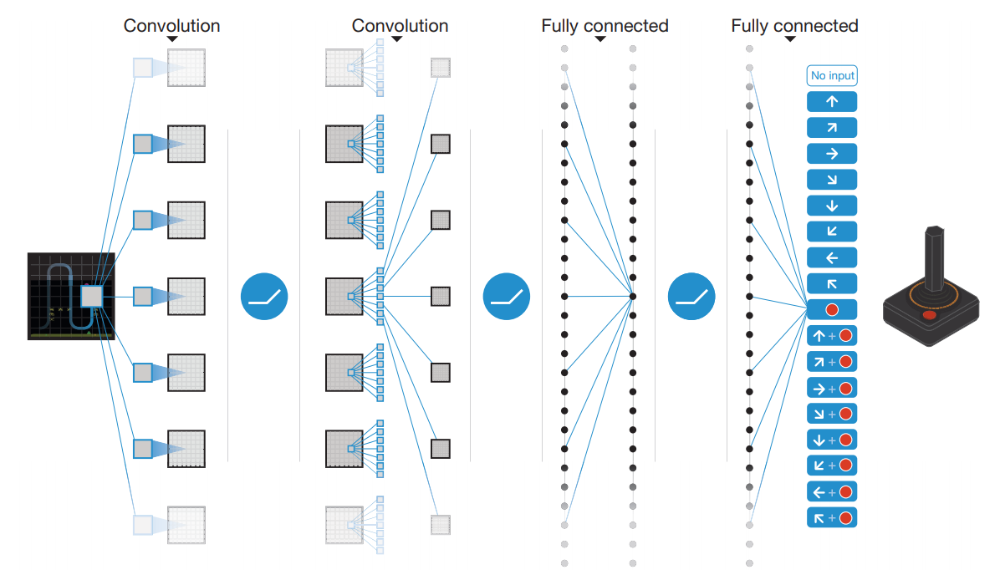

# Deep Q-Networks  
基本思想：随着state的增多，action的增多，或者state或者action为连续空间值，建立Q-table将不再合适。一种解决方法就是：用神经网络代替Q-table，其接受state输出所有动作的Q值。
## paper分析
用神经网络预测Q值  
1. state：为了减少数量，进行一下操作：  
彩图转灰度图； 
图像大小减少；  
由于帧与帧之间存在顺序关系，所以一个state由4帧组成。  
2. Q value  
通过CNN网络生成每个动作的Q value  

3. Experience Replay
通过建立database of samples,并从其中学习mapping，将强化学习问题转化成了监督学习。
* 原因：
    * naive Q-learning使用一组 <S, A, S', R> 后直接抛弃，效率不高，因此可以将所有**经验**存储在replay buffer，并在之后的学习中使用
    * 由于经验之间存在强相关(highly correlated),naive Q-learning面临着Q不收敛的风险
* 解决：
    * 在训练初始阶段，只采集经验，并不学习，尽可能探索。
    * 从replay beffer中随机采样，避免了经验间的相关性。

### reference
- Mnih, Volodymyr, et al. "Human-level control through deep reinforcement learning." Nature518.7540 (2015): 529. http://www.davidqiu.com:8888/research/nature14236.pdf